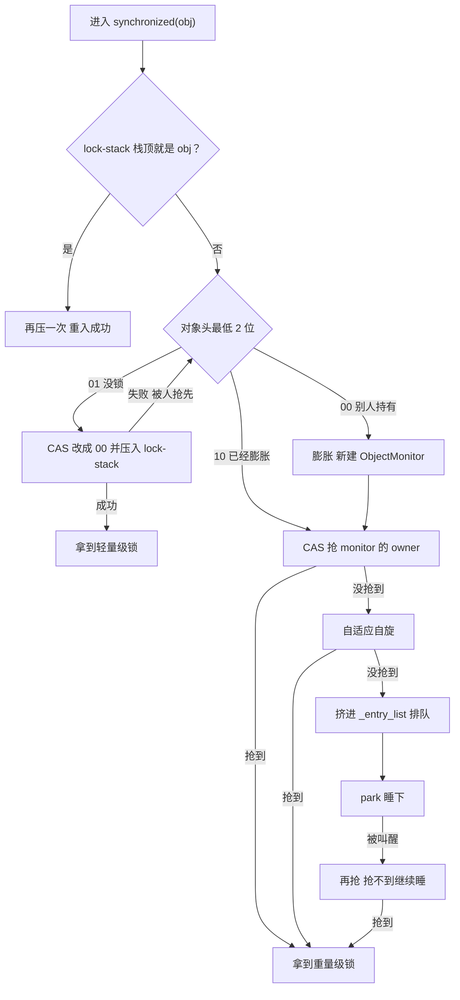
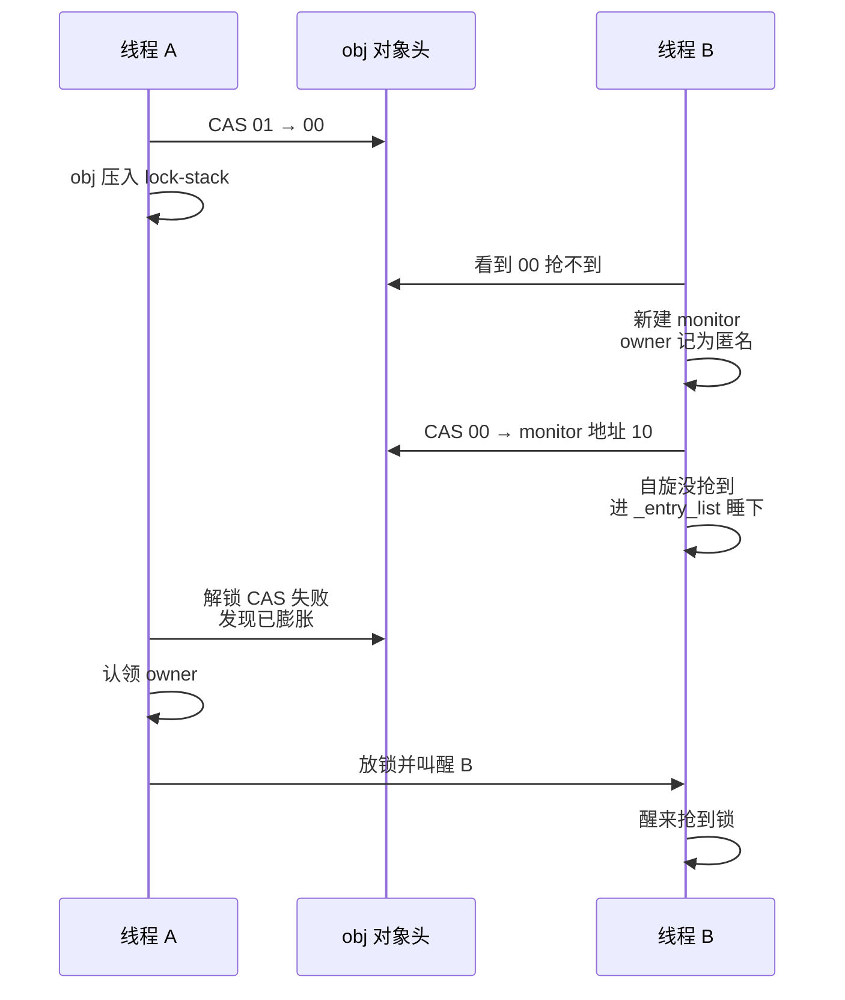
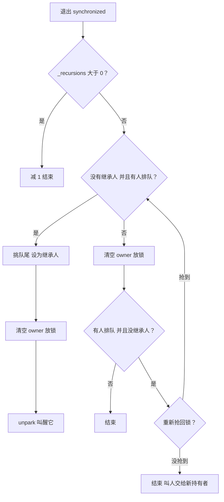
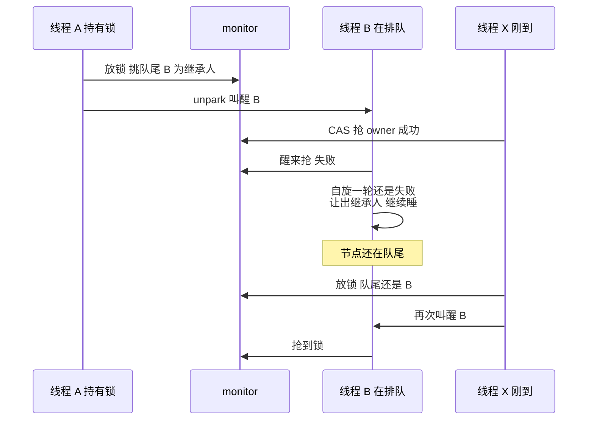
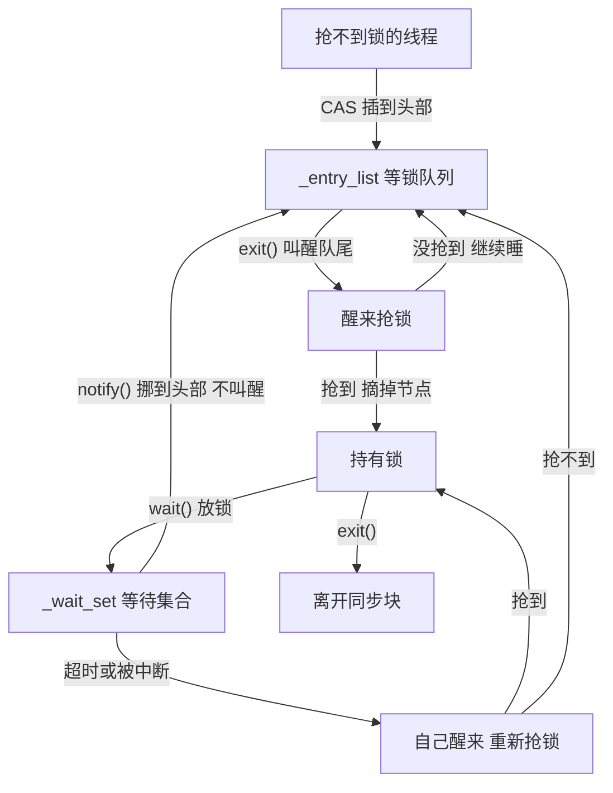

# synchronized 锁升级与工作流程（JDK 25）

::: info 阅读说明
- 以 **JDK 25（LTS）默认配置**的 64 位 HotSpot 为主线：新轻量级锁、ObjectMonitorTable 默认关、紧凑对象头默认关
- 每一步都对照了 JDK 25 源码（`lightweightSynchronizer.cpp`、`objectMonitor.cpp`），括号里标了函数名，方便自己去翻
- JDK 21、JDK 27 和本文不一样的地方见文末[版本差异](#版本差异)；各版本的完整变化见[《synchronized 版本演进》](./synchronized-versions)
:::

## 先认识几个词

| 术语 | 通俗解释 |
|---|---|
| Mark Word | 每个对象开头的 8 个字节，记着 hash、GC 年龄等，最低 2 位是**锁标志位** |
| 锁标志位 | `01` 没锁，`00` 轻量级锁，`10` 重量级锁 |
| CAS | 比较并交换。CPU 保证一次做完的操作："这个值如果还是 A，就改成 B；不是就告诉我失败"。几个线程同时改，只有一个能成功，不用加锁 |
| 自旋 | 抢不到锁先不睡，在 CPU 上空转一小会儿再抢，赌锁马上会被放掉。省掉"睡下再叫醒"的开销，代价是占着 CPU |
| park / unpark | 让线程真正睡下 / 把它叫醒。要经过操作系统，比自旋慢得多 |
| 轻量级锁 | 没人抢时用的锁，只改对象头的锁标志位 |
| lock-stack | 每个线程自带的小数组，最多 8 格，记"我手上有哪些轻量级锁" |
| 膨胀 | 有人来抢（或者调用了 `wait()`），给对象配一个 ObjectMonitor，升级成重量级锁 |
| ObjectMonitor | 重量级锁的"管理员"，记着锁归谁、谁在排队、谁在 `wait()` |
| 重入 | 已经拿着这把锁的线程，又进入同一把锁的 `synchronized` |
| 继承人（`_succ`） | 已经被叫醒、或者正在自旋、马上会来抢锁的线程。有它在，放锁的线程就不用再去叫人 |
| 安全点 | JVM 让所有 Java 线程停下来的时刻，比如 GC 的某些阶段 |
| 内存屏障 | 一种让 CPU 保证"前面写进去的值，别的线程马上能读到"的操作 |
| 虚拟线程 / 载体线程 | 虚拟线程是 JDK 21 起的轻量线程，实际跑在底下的平台线程（载体线程）上 |

## 全流程一张图



下面按这张图一步步拆开讲。

## 第 1 步：没人抢，用轻量级锁

### 加锁

（`LightweightSynchronizer::enter`）

1. **先看是不是重入**：lock-stack 没满，并且栈顶正好是 obj，就再压一次，直接成功，不做 CAS
2. **对象没锁（`01`）**：CAS 把最低 2 位改成 `00`，再把 obj 压进 lock-stack
   - lock-stack 满了（8 格）：先把栈里"已经被别人膨胀了"的锁交接成正式的重量级锁，腾出位置；还是满，就把栈底最早拿到的那把锁膨胀掉
3. **对象被别人锁着（`00`）**：进入第 2 步，膨胀

对象头只改了 2 位，hash、GC 年龄都原地不动。锁归谁，对象头里不记，记在线程自己的 lock-stack 里。

### 重入

```text
synchronized (a) {              // lock-stack: [a]
    synchronized (a) {          // lock-stack: [a, a]
        synchronized (b) {      // lock-stack: [a, a, b]
            synchronized (a) {  // 栈顶是 b，不是 a
```

- **第 2 层**：栈顶是 a，连续重入，再压一次，不做 CAS
- **第 4 层**：栈顶是 b，中间夹了别的锁，a 膨胀成重量级锁；lock-stack 里的两个 a 挪走，改由 monitor 记重入次数

### 解锁

（`LightweightSynchronizer::exit`）

1. lock-stack 栈顶两格都是 obj：重入退出，弹掉一格就行
2. 否则 CAS 把 `00` 改回 `01`，从 lock-stack 删掉 obj
3. CAS 失败：说明对象已经被别人膨胀了，改走重量级锁的解锁（见第 2 步最后）

::: tip 为什么叫"轻量"
整个过程只有 CAS 和线程自己的一个小数组，不创建任何对象，也不涉及操作系统。
:::

## 第 2 步：有人抢，膨胀成重量级锁

### 谁会触发膨胀

- 线程加锁时，发现对象被**别人**轻量级锁住了
- 非连续重入（上面例子里的第 4 层）
- lock-stack 满了，要腾位置
- 在对象上调用 `wait()`：等待队列只有 ObjectMonitor 才有，所以一定会膨胀。`notify()` 不会：对象还没膨胀，说明不可能有人在 `wait()`，直接返回

### 膨胀过程

（`LightweightSynchronizer::inflate_into_object_header`）

线程 B 发现对象头是 `00`，被线程 A 锁着：

1. 新建一个 ObjectMonitor，把对象头的原内容（hash、年龄）存进去
2. owner 记成**匿名**：B 不知道锁在谁手里，因为新轻量级锁的对象头里本来就不记持有者
3. CAS 把对象头从 `00` 换成 `monitor 地址 | 10`
   - **成功**：膨胀完成
   - **失败**：对象头变了，比如 A 恰好解锁了。B 删掉刚建的 monitor，重新看对象头：已经是 `10` 就直接用现成的；变成了没锁，就重新膨胀一次，这次 owner 是空的，B 进去一抢就拿到
4. B 进入 ObjectMonitor 抢锁（第 3 步）

JDK 25 默认配置下，B 发现锁被别人拿着，**不自旋，直接膨胀**。膨胀前先自旋只在开启 ObjectMonitorTable 时才有，JDK 27 起默认开启。

### A 解锁时认领 owner

A 想用 CAS 把 `00` 改回 `01`，会失败，于是：

1. 从对象头拿到 monitor，发现 owner 是匿名
2. 在自己的 lock-stack 里找到 obj，确认是自己的锁，把 owner 改成自己；lock-stack 里 obj 有几个，就换算成重入次数
3. 按重量级锁的方式解锁（第 4 步），叫醒 B



::: warning 膨胀后不会马上变回来
就算后来没人抢了，对象也一直是重量级锁，直到后台线程把空闲的 monitor 回收掉（第 7 步）。
:::

## 第 3 步：重量级锁怎么抢

### ObjectMonitor 里有什么

（`objectMonitor.hpp`）

| 字段 | 通俗解释 |
|---|---|
| `_owner` | 锁归谁，存线程 ID。0 表示没人，1 表示匿名，2 表示正在被回收 |
| `_recursions` | 重入次数，第一次进入是 0 |
| `_entry_list` | **等锁队列**的头：抢不到锁的线程在这里排队 |
| `_entry_list_tail` | 等锁队列的尾：最早来排队的那个 |
| `_succ` | 继承人 |
| `_wait_set` | **等待集合**：调用了 `wait()` 在休息的线程 |
| `_contentions` | 正在抢这把锁的线程数，回收时用来判断能不能回收 |

### 抢锁过程

（`ObjectMonitor::enter` → `enter_internal`）

1. **直接抢**：CAS 把 `_owner` 从 0 改成自己的线程 ID，成功就拿到锁
2. **重入**：`_owner` 就是自己，`_recursions` 加 1
3. **自适应自旋**（`try_spin`）：
   - 先快速试 10 次
   - 再盯着 `_owner` 最多转 `_SpinDuration` 圈（初始 5000），一看到锁空了就 CAS 去抢
   - "自适应"是说圈数会变：这次抢到了，就把圈数调高（至少调到 1100，每次加 100，上限约 5000）；转满了都没抢到，就减 200，最少到 0
   - 转的时候把自己登记成继承人，放锁的线程看到有人在转，就不用去叫醒别人
   - 看到持有者换人了、或者 JVM 要进安全点，马上停
4. **排队**：
   - 进队前再抢一次、再转一轮
   - 把自己包成一个节点（`ObjectWaiter`），用 CAS 插到 `_entry_list` **头部**。CAS 失败说明别人也在插，先顺手抢一下锁，抢到就不排了
   - 睡之前**再抢一次**：防止自己刚排进来，锁正好被放了，结果没人来叫
5. **睡下**：park。这时用 `jstack` 看，线程状态是 `BLOCKED`
6. **被叫醒**：再抢一次 → 抢不到再转一轮 → 还不行就让出继承人的身份，继续睡
7. **抢到后**：把自己的节点从 `_entry_list` 摘掉

### 等锁队列长什么样

源码 `objectMonitor.cpp` 开头的注释里就有这个例子：

```text
A、B、C 依次来排队，每个都 CAS 插到头部：
    _entry_list → C → B → A          队尾是 A（最早来的）

放锁时从队尾挑人：叫醒 A
A 抢到锁，把自己摘掉：
    _entry_list → C → B              队尾变成 B

这时 D 来排队，照样插到头部：
    _entry_list → D → C → B          下一个被叫醒的还是 B
```

- **插入**：新线程只管往头部插，用 CAS 就行，不用加锁
- **找队尾、摘节点**：只有持有锁的线程能做。刚插进来的节点只有向后的指针，放锁的线程找队尾时顺着走一遍，顺便把反向指针补上

::: tip 虚拟线程
虚拟线程抢不到锁时，会先把自己的调用栈存到堆里，从载体线程上卸下来再排队，载体线程可以去跑别的虚拟线程（JDK 24 起，JEP 491）。轮到它时，由一个专门的 unblocker 线程把它重新交给调度器。
:::

## 第 4 步：释放锁

（`ObjectMonitor::exit`）

1. **`_recursions` 大于 0**：减 1，结束，只是退出一层重入
2. **有人排队，又没有继承人**：
   - 找到队尾，也就是最早来的线程
   - 把它设成继承人 → 清空 `_owner` 放锁 → unpark 叫醒它
3. **其他情况**：先清空 `_owner` 放锁，再看一眼：
   - 没人排队，或者已经有继承人（有人在自旋、或者刚被叫醒还没来抢）：直接走
   - 有人排队又没继承人（放锁这一瞬间有人进了队，或者原来的继承人放弃了）：重新抢回锁，回到第 2 种情况挑人；抢不回来说明锁已经被别人拿走，叫人的事交给新的持有者



### 叫醒不等于把锁交给它

源码里管这叫**竞争式交接**：放锁的线程只负责叫醒继承人，不直接把锁交到它手上。继承人醒来还得自己抢，这时刚到的线程也可能在抢（它排队前会先抢、先自旋），谁先 CAS 成功算谁的。

所以 synchronized 是**非公平锁**。好处是正在 CPU 上跑的线程可以直接拿锁，不用等一个睡着的线程被系统叫醒，整体吞吐更高。



### 为什么不会"没人叫"

放锁和排队的顺序正好相反：

- **排队的线程**：先进队，再看锁（睡前再抢一次）
- **放锁的线程**：先放锁，再看队（第 3 种情况）

两边至少有一方能看到对方：要么放锁的看到有人排队去叫人，要么排队的看到锁空了直接抢走。为了保证另一个 CPU 真能按这个顺序看到写入，放锁后还加了一次内存屏障（`OrderAccess::storeload()`）。

## 第 5 步：wait / notify / notifyAll

### wait()

（`ObjectMonitor::wait`）

1. 没持有锁：抛 `IllegalMonitorStateException`
2. 线程已经被中断：直接抛 `InterruptedException`，锁不放
3. 把自己包成节点，加到 `_wait_set` **队尾**
4. 记下重入次数，清零，调用第 4 步的 exit **一次性把锁放掉**，重入几层都放。放锁时会按规则叫醒排队的人
5. park 睡下，线程状态是 `WAITING`；`wait(毫秒)` 是 `TIMED_WAITING`
6. 醒来之后分两种情况：
   - **被 notify 过**：节点已经被挪进 `_entry_list`，按排队线程的方式重新抢锁
   - **超时、被中断、或者无缘无故醒了**（叫虚假唤醒）：节点还在 `_wait_set`，自己摘出来，按普通抢锁流程重新进入
7. 抢回锁后，恢复原来的重入次数。如果没被 notify、而是被中断醒的，抛 `InterruptedException`

::: warning 一定要用 while 包住 wait()
源码注释写明虚假唤醒按超时处理，`wait()` 返回不代表条件已经满足：

```java
synchronized (lock) {
    while (!ready) {
        lock.wait();
    }
}
```
:::

### notify()

（`ObjectMonitor::notify_internal`）

1. 没持有锁：抛 `IllegalMonitorStateException`
2. 从 `_wait_set` 取出**最早** wait 的那个节点
3. 标记为"已通知"，用 CAS 插到 `_entry_list` 头部，线程状态变成 `BLOCKED`
4. **不叫醒它**：调用 notify 的线程还拿着锁，叫醒了也抢不到，白醒一次。等 notify 的线程退出同步块，由 exit 按顺序叫醒

插到头部意味着：被 notify 的线程要排在**已经在等锁的线程后面**。

### notifyAll()

把 `_wait_set` 里的节点一个个挪进 `_entry_list`。源码注释里的例子：

```text
_wait_set:   A B C D（A 最早 wait）
_entry_list: X → Y → Z（Z 最早来排队）

notifyAll 之后：
_entry_list: D → C → B → A → X → Y → Z
没有新线程插队的话，叫醒顺序：Z、Y、X、A、B、C、D
```

### 一次完整的 wait / notify


## 第 6 步：两个队列怎么流转



| 线程在做什么 | `jstack` 看到的状态 |
|---|---|
| 在 `_entry_list` 里等锁 | `BLOCKED (on object monitor)` |
| 在 `_wait_set` 里 `wait()` | `WAITING (on object monitor)` |
| 在 `_wait_set` 里 `wait(毫秒)` | `TIMED_WAITING (on object monitor)` |
| 被 notify 后等着重新抢锁 | `BLOCKED (on object monitor)` |

## 第 7 步：空闲回收，锁也会"降级"

（`ObjectMonitor::deflate_monitor`）

- **谁来做**：后台有一个 `Monitor Deflation Thread` 线程专门干这件事
- **什么时候做**：在用的 monitor 超过上限的 90% 时，最快每 250 毫秒一次；不管用了多少，至少每 60 秒一次
- **能回收的条件**：没人持有、没人排队、没人 `wait()`、没人正在抢
- **回收过程**：
  1. CAS 把 `_owner` 从 0 改成"正在回收"的标记
  2. 再确认没人来抢：CAS 把 `_contentions` 从 0 改成负数
  3. 把 monitor 里存的原对象头写回对象，对象恢复成没锁（`01`）
- **撞上回收怎么办**：两次 CAS 中间要是有线程来抢，回收就放弃；抢锁的线程如果撞见已经回收完的 monitor，会重新走一遍加锁流程

## 版本差异

| 环节 | JDK 21（LTS） | JDK 25（本文） | JDK 27 |
|---|---|---|---|
| 偏向锁 | 没有 | 没有 | 没有 |
| 轻量级锁 | 默认传统栈锁：对象头整个换成栈上 Lock Record 地址 | lock-stack，只改锁标志位 | 同 JDK 25 |
| 膨胀 | 要经过 `INFLATING` 中间状态；不自旋 | owner 先记匿名；默认不自旋 | 默认先自旋，最多 CAS 8 次 |
| monitor 放哪 | 对象头存 monitor 地址 | 对象头存 monitor 地址 | 单独的 ObjectMonitorTable，对象头不动 |
| 持有者 `_owner` | 线程指针或 Lock Record 地址 | 线程 ID | 线程 ID |
| 等锁队列 | `_cxq` + `_EntryList` 两条 | 一条 `_entry_list`，先来先叫醒 | 同 JDK 25 |
| notify 挪到哪 | `_EntryList` 为空就放进去，否则插 `_cxq` 头部 | 插 `_entry_list` 头部 | 同 JDK 25 |
| 防止没人叫醒 | 指定一个 `_Responsible` 线程定时醒来检查 | 放锁后加内存屏障 | 同 JDK 25 |
| 放锁时挑人 | 先放锁，再看队列 | 有人排队且没继承人时，先挑好人再放锁 | 同 JDK 25 |

::: details JDK 21 的 _cxq 和 _EntryList 怎么流转
- 抢不到锁的线程先 CAS 插到 `_cxq` 头部
- 放锁时：`_EntryList` 不为空，就叫醒它的头节点；为空，才把 `_cxq` 整条摘下来当成新的 `_EntryList`，顺序不变，再叫醒头节点
- 因为 `_cxq` 是头插的，同一批里**后来的线程先被叫醒**；批与批之间，先来的先叫

```text
B、C、D 依次抢锁失败：      _cxq → D → C → B
放锁时 _EntryList 为空：    _EntryList → D → C → B，叫醒 D
```
:::

::: details 偏向锁（JDK 6 ~ 14 默认开启，了解即可）
- 开启后新对象是"匿名偏向"：对象头里线程指针为 0
- 第一次加锁：CAS 把自己的线程指针写进对象头
- 之后同一个线程再进出：只比较对象头，不做 CAS，不写内存
- 别的线程来抢、或者计算了对象的原始 hash（`Object.hashCode()` / `System.identityHashCode()`）：撤销偏向，变成轻量级锁或无锁
- JDK 15 默认关闭，JDK 18 删除代码，详见[《synchronized 版本演进》](./synchronized-versions)
:::

## 参考源码

**JDK 25**

- [lightweightSynchronizer.cpp](https://github.com/openjdk/jdk/blob/jdk-25-ga/src/hotspot/share/runtime/lightweightSynchronizer.cpp)：轻量级锁加锁、解锁、膨胀
- [objectMonitor.cpp](https://github.com/openjdk/jdk/blob/jdk-25-ga/src/hotspot/share/runtime/objectMonitor.cpp)：抢锁、排队、放锁、wait / notify、回收，开头有队列设计的注释
- [objectMonitor.hpp](https://github.com/openjdk/jdk/blob/jdk-25-ga/src/hotspot/share/runtime/objectMonitor.hpp)：ObjectMonitor 的字段
- [lockStack.inline.hpp](https://github.com/openjdk/jdk/blob/jdk-25-ga/src/hotspot/share/runtime/lockStack.inline.hpp)：lock-stack 的重入判断
- [synchronizer.cpp](https://github.com/openjdk/jdk/blob/jdk-25-ga/src/hotspot/share/runtime/synchronizer.cpp)：wait / notify 入口、回收触发条件

**对照版本**

- [JDK 21 objectMonitor.cpp](https://github.com/openjdk/jdk/blob/jdk-21-ga/src/hotspot/share/runtime/objectMonitor.cpp)：`_cxq`、`_EntryList`、`_Responsible`
- [JDK 27 synchronizer.cpp](https://github.com/openjdk/jdk/blob/jdk27/src/hotspot/share/runtime/synchronizer.cpp)：默认开启 ObjectMonitorTable 后的自旋
- [JEP 491: Synchronize Virtual Threads without Pinning](https://openjdk.org/jeps/491)
