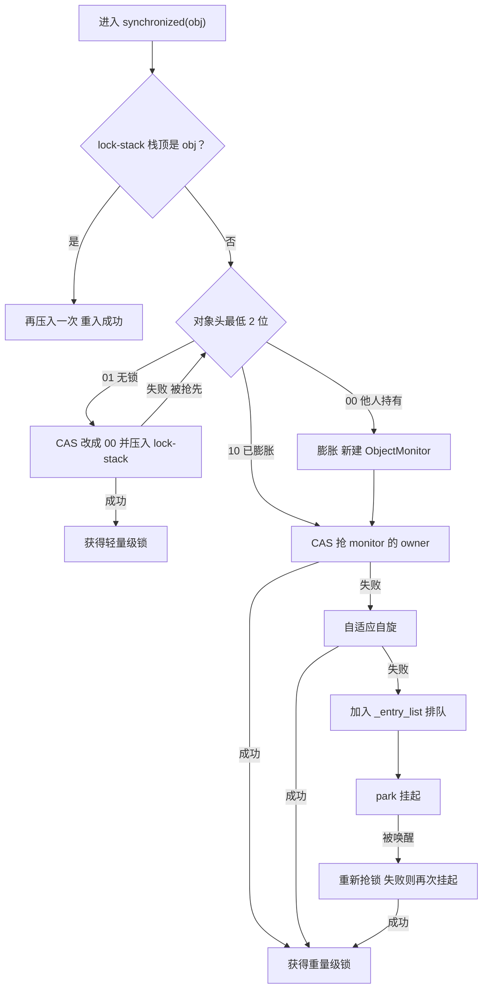
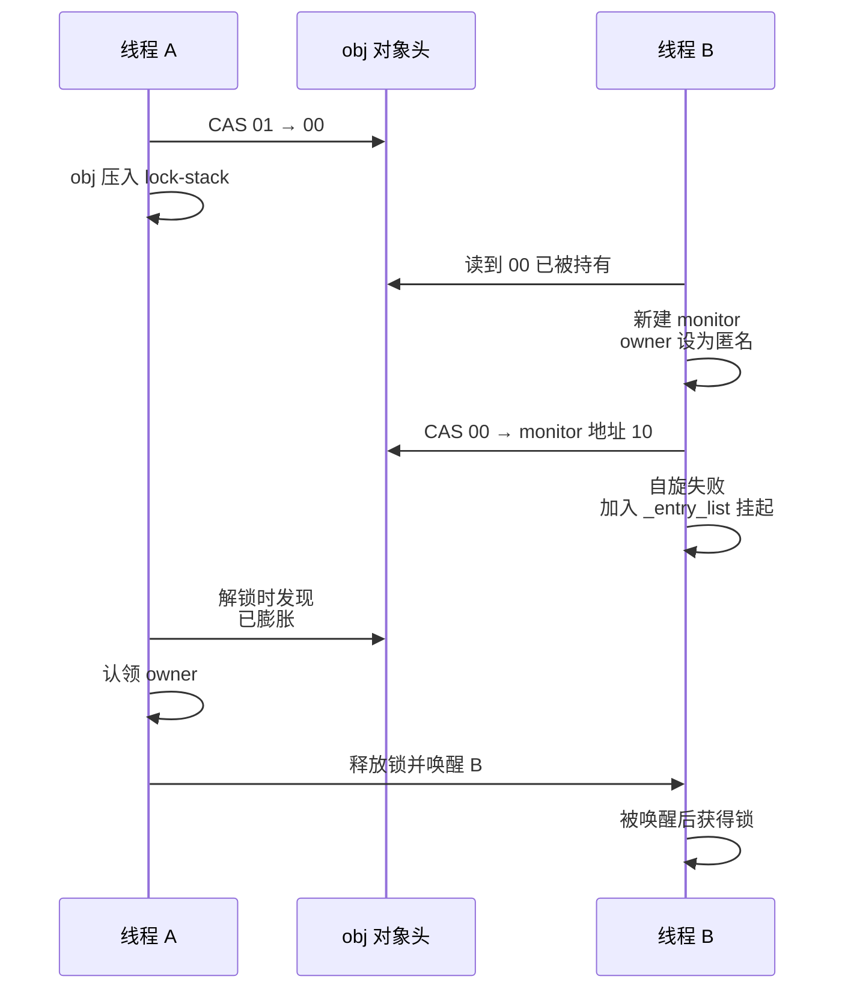
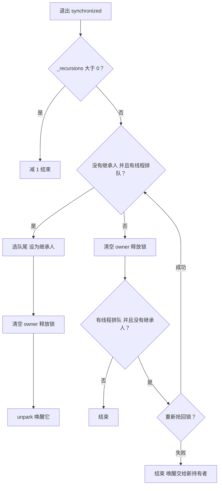
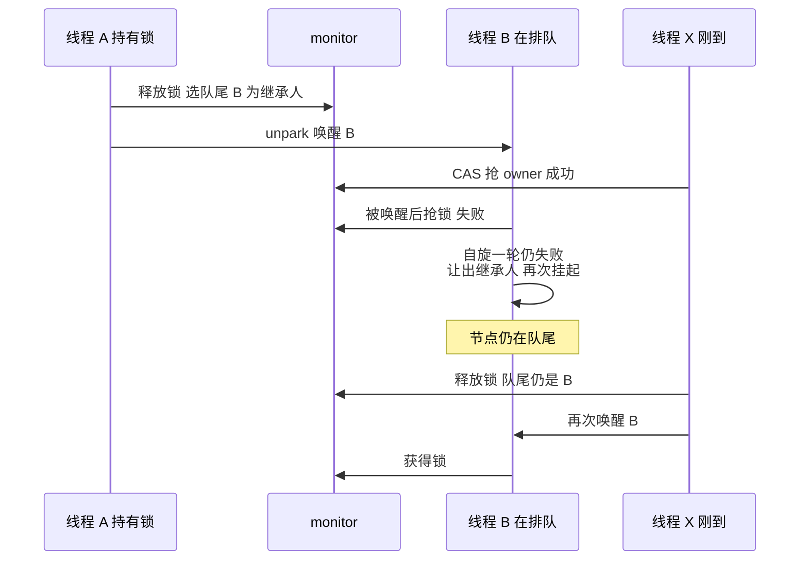
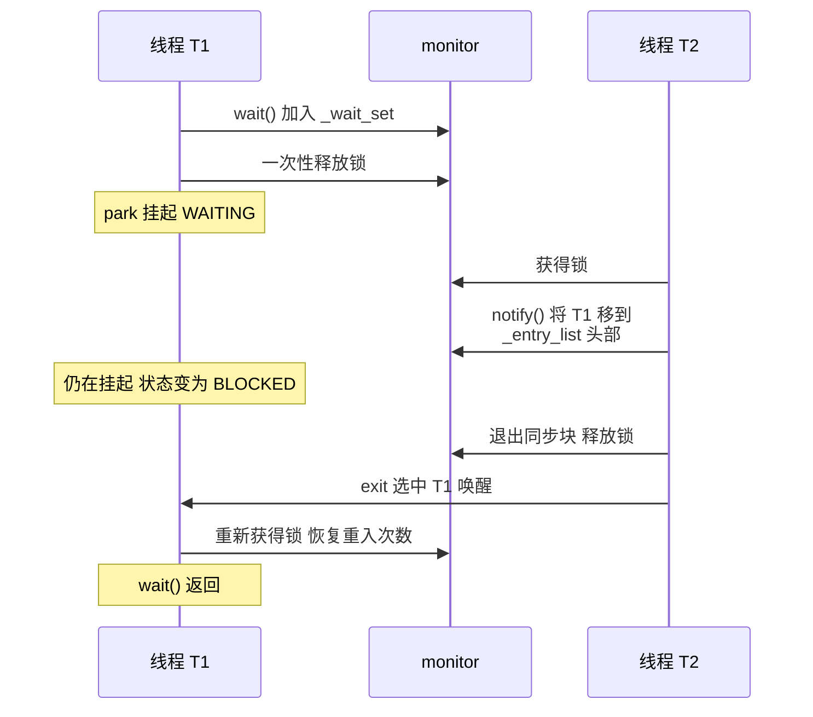
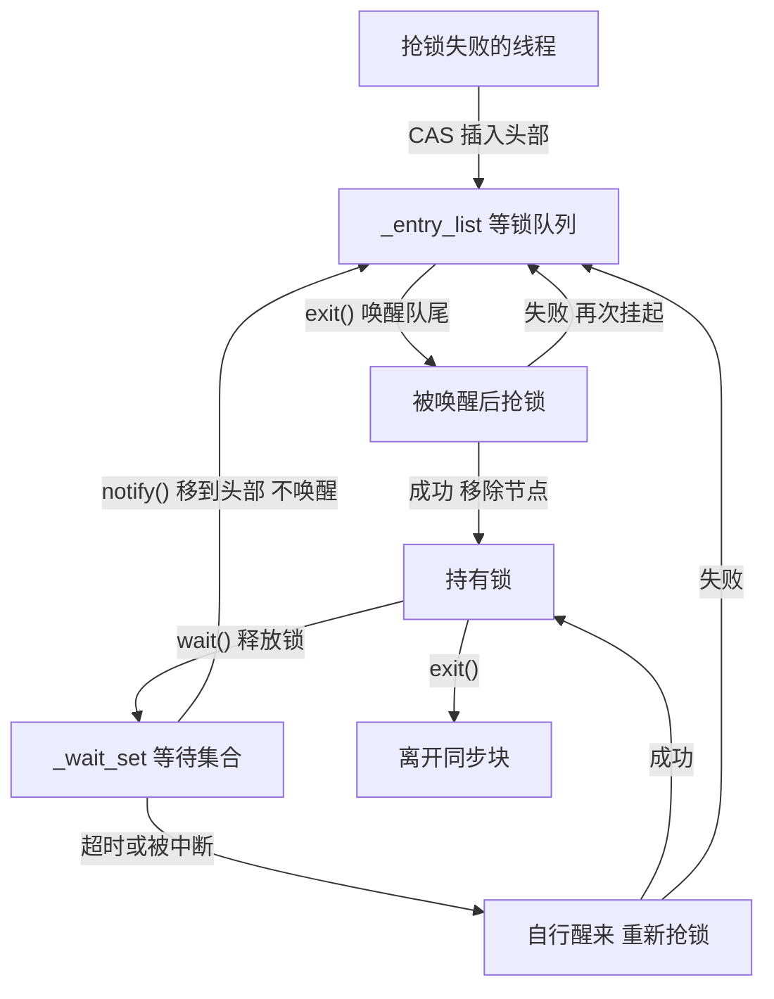

# synchronized 锁升级与工作流程（JDK 25）

::: info 阅读说明
- 以 **JDK 25（LTS）默认配置**的 64 位 HotSpot 为主线：新轻量级锁、ObjectMonitorTable 默认关、紧凑对象头默认关
- 每一步都对照了 JDK 25 源码（`lightweightSynchronizer.cpp`、`objectMonitor.cpp`），关键处附简化源码，括号内标注函数名，便于对照
- JDK 21、JDK 27 与本文的差异见文末[版本差异](#版本差异)；各版本的完整变化见[《synchronized 版本演进》](./synchronized-versions)
:::

## 术语

| 术语 | 说明 |
|---|---|
| Mark Word | 对象头的前 8 个字节，存放 hash、GC 年龄等信息，最低 2 位是**锁标志位** |
| 锁标志位 | `01` 无锁，`00` 轻量级锁，`10` 重量级锁 |
| CAS | Compare-And-Swap，CPU 提供的原子指令：值仍等于预期值 A 时改为 B，否则失败。多个线程同时修改，只有一个成功，无需加锁 |
| 自旋 | 抢锁失败后不立即挂起，而是在 CPU 上循环重试，赌持有者很快释放。省掉挂起和唤醒的开销，代价是占用 CPU |
| park / unpark | 挂起 / 唤醒线程。需要操作系统介入（系统调用 + 上下文切换），开销远大于自旋 |
| 轻量级锁 | 无竞争时使用的锁，只修改对象头的锁标志位 |
| lock-stack | 每个线程私有的小数组，容量 8，记录该线程持有的轻量级锁 |
| 膨胀 | 出现竞争（或调用 `wait()`）时，为对象分配一个 ObjectMonitor，升级为重量级锁 |
| ObjectMonitor | 重量级锁的实体，记录持有者、等锁队列和调用了 `wait()` 的线程 |
| 重入 | 已持有锁的线程再次进入同一把锁的 `synchronized` |
| 继承人（`_succ`） | 标记"已经有线程会来抢锁"，释放锁的线程看到它就不再唤醒别人。**不代表锁归它**，它仍要自己竞争 |
| 安全点 | JVM 让所有 Java 线程暂停的时刻，例如 GC 的某些阶段 |
| 内存屏障 | 约束内存读写顺序的指令。本文涉及的 StoreLoad 屏障保证：屏障前的写入对其他 CPU 可见之后，才执行屏障后的读取 |
| 虚拟线程 / 载体线程 | 虚拟线程是 JDK 21 正式引入的轻量级线程，运行在底层的平台线程（载体线程）上 |

## 整体流程

::: warning 注意：JDK 25 只有一条等锁队列
下图中的等锁队列**只有一条** `_entry_list`。常见的 `_cxq` + `_EntryList` 双队列讲法对应 **JDK 24 及以前**的实现；JDK 25 将两条合并为一条，唤醒顺序也随之改变，见文末[版本差异](#版本差异)。
:::



下面按图中顺序逐步展开。

## 第 1 步：无竞争，使用轻量级锁

### 加锁

（`LightweightSynchronizer::enter`）

1. **先判断重入**：lock-stack 未满且栈顶就是 obj，再压入一次即可，不做 CAS
2. **对象无锁（`01`）**：CAS 把最低 2 位改成 `00`，再把 obj 压入 lock-stack
   - lock-stack 已满（8 格）：先把栈中已被其他线程膨胀的锁认领过来（owner 改为自己，移出 lock-stack），腾出位置；仍然满，就把栈底最早获得的那把锁膨胀
3. **对象被其他线程锁住（`00`）**：进入第 2 步，膨胀

对象头只改了 2 位，hash、GC 年龄保持不变。锁的归属不记录在对象头里，而是记录在持有线程的 lock-stack 中。

### 重入

```text
synchronized (a) {              // lock-stack: [a]
    synchronized (a) {          // lock-stack: [a, a]
        synchronized (b) {      // lock-stack: [a, a, b]
            synchronized (a) {  // 栈顶是 b，不是 a
```

- **第 2 层**：栈顶是 a，属于连续重入，再压入一次，不做 CAS
- **第 4 层**：栈顶是 b，a 的重入被其他锁隔开，a 膨胀为重量级锁；lock-stack 中的两个 a 被移除，重入次数改由 monitor 记录

### 解锁

（`LightweightSynchronizer::exit`）

1. lock-stack 栈顶两格都是 obj：属于重入退出，弹出一格即可
2. 否则用 CAS 把 `00` 改回 `01`，并从 lock-stack 移除 obj
3. CAS 失败：说明对象已被其他线程膨胀，转入重量级锁的解锁流程（见第 2 步末尾）

::: tip 为什么叫"轻量"
整个过程只涉及 CAS 和线程私有的小数组，不分配任何对象，也不需要操作系统介入。
:::

## 第 2 步：出现竞争，膨胀为重量级锁

### 触发膨胀的情况

- 加锁时发现对象被**其他线程**轻量级锁住
- 非连续重入（上例第 4 层）
- lock-stack 已满，需要腾出位置
- 在对象上调用 `wait()`：等待集合只有 ObjectMonitor 才有，所以必然膨胀。`notify()` 则不会：对象尚未膨胀，说明不可能有线程在 `wait()`，直接返回

### 膨胀过程

（`LightweightSynchronizer::inflate_into_object_header`）

线程 B 发现对象头是 `00`，即被线程 A 持有：

1. 新建一个 ObjectMonitor，把对象头的原内容（hash、GC 年龄）保存进去
2. owner 设为**匿名**：新轻量级锁的对象头不记录持有者，B 无从得知锁在谁手里
3. CAS 把对象头从 `00` 换成 `monitor 地址 | 10`
   - **成功**：膨胀完成
   - **失败**：对象头已经变化，可能是 A 刚好解锁，也可能是其他线程抢先完成了膨胀。B 删除刚建的 monitor，重新读取对象头：已是 `10` 就直接使用现有的 monitor；已变成无锁，就重新膨胀一次，此时 owner 为空，B 进入后即可获得锁
4. B 进入 ObjectMonitor 竞争锁（第 3 步）

monitor 是**先初始化、再挂到对象头上**的：对象头一旦指向它，其他线程会立即使用，所以原对象头和 owner 必须提前设好。新轻量级锁只改锁标志位，原对象头仍完整保留在 Mark Word 中，B 可以直接复制，因此不需要传统栈锁的 `INFLATING` 中间状态；代价是并发膨胀时可能多建几个 monitor。

**多个线程同时竞争**：假设 C 也来抢锁，结果取决于它读取对象头时 B 的 CAS 是否已成功：

- 已经是 `10`：直接使用 B 创建的 monitor，不新建，也不修改 owner（匿名 owner 只能由持锁的 A 认领）
- 仍然是 `00`：C 同样新建一个匿名 owner 的 monitor 去 CAS。两者只有一个成功，失败方删除自己的 monitor，改用胜出方的

因此一个对象最终只会关联一个 monitor。monitor 也不属于创建它的线程：B、C 进入的是同一个 monitor，竞争地位完全相同。

JDK 25 默认配置下，B 发现锁被其他线程持有时**不自旋，直接膨胀**。膨胀前先自旋只在开启 ObjectMonitorTable 时才有，JDK 27 起默认开启。

### A 解锁时认领 owner

A 解锁时发现对象头已是 `10`（或 CAS 改回 `01` 失败），说明对象已被膨胀，于是：

1. 从对象头取得 monitor，发现 owner 是匿名
2. 在自己的 lock-stack 中找到 obj，确认锁属于自己，把 owner 改为自己；lock-stack 中 obj 出现几次，就换算成相应的重入次数
3. 按重量级锁的方式解锁（第 4 步），从等锁队列中唤醒一个线程

必须先认领，是因为重量级锁的解锁（`ObjectMonitor::exit`）第一步就检查 owner 是否为当前线程，匿名 owner 无法通过。认领对 B、C 不可见，它们等待的只是 `_owner` 变回 0。



::: warning 膨胀后不会立即恢复
即使之后不再有竞争，对象也一直保持重量级锁状态，直到后台线程回收空闲的 monitor（第 7 步）。
:::

## 第 3 步：竞争重量级锁

### ObjectMonitor 的字段

（`objectMonitor.hpp`）

| 字段 | 说明 |
|---|---|
| `_owner` | 持有者的线程 ID。0 表示无人持有，1 表示匿名，2 表示正在被回收 |
| `_recursions` | 重入次数，首次进入为 0 |
| `_entry_list` | **等锁队列**的头部，抢锁失败的线程在此排队 |
| `_entry_list_tail` | 等锁队列的尾部，即最早排队的线程 |
| `_succ` | 继承人，标记已有线程会来抢锁，使释放锁的线程省去一次多余的唤醒 |
| `_wait_set` | **等待集合**，存放调用了 `wait()` 的线程 |
| `_contentions` | 正在竞争这把锁的线程数，回收时据此判断能否回收 |

### 抢锁过程

（`ObjectMonitor::enter` → `enter_internal`）

两条快速路径：

- **直接获取**：CAS 把 `_owner` 从 0 改为自己的线程 ID，成功即获得锁
- **重入**：`_owner` 已是自己，`_recursions` 加 1

都不满足才进入慢速路径。从进入 monitor 到真正挂起，线程会多次尝试获取锁：

```text
enter
├─ try_enter        ← 尝试 ①（同时检查重入）
├─ try_spin         ← 第 1 轮自旋
└─ enter_internal
     ├─ try_lock    ← 尝试 ②
     ├─ try_spin    ← 第 2 轮自旋
     ├─ 入队        ← CAS 失败时顺便 try_lock，尝试 ③
     ├─ try_lock    ← 尝试 ④：park 前的最后一次
     ├─ park        ← 挂起
     └─ 被唤醒：try_lock → try_spin → 仍失败则再次 park
```

**为什么要尝试这么多次？** 越往后的步骤代价越高：入队要分配节点、CAS 修改链表；park 要进入内核，一次挂起加唤醒是**微秒级**。而 `try_lock` 只是一次 CAS，**纳秒级**。成本相差几个数量级，所以每进入下一个更昂贵的阶段之前，都值得再试一次。

下面分别展开自旋和排队两部分。

### 自适应自旋（`try_spin`）

**为什么要自旋。** 抢锁失败后有两种选择：park 挂起需要进入内核，微秒级；自旋则在 CPU 上循环，每轮只读一次 `_owner`，纳秒级。如果锁很快释放（比如同步块里只有一行 `count++`），自旋几百轮就能等到，比挂起便宜几个数量级；但如果持有者在同步块里做 IO，自旋再久也只是浪费 CPU。

**难点在于 JVM 事先无法知道锁会被持有多久。** 因此它不做预测，而是根据**这把锁过去的自旋结果**来调整，这就是"自适应"。

每个 ObjectMonitor 有一个计数器 `_SpinDuration`，表示**这把锁值得自旋多少轮**，初始值 5000。自旋成功就调高，自旋满额仍失败就调低：

```c
adjust_up(x)                            adjust_down(x)
  x >= 5000        → 不动                 x -= 200，最低到 0
  1000 <= x < 5000 → x + 100
  x < 1000         → 拉到 1000 再 +100 = 1100
```

三个参数的考虑：

- **为什么成功要调高？** `adjust_down` 只会减少，如果成功时不增加，这个值只降不升，最终归零，自适应就失效了。而且它**只知道成功、不知道用了多少轮**（源码中的 `CONSIDER: factor "ctr" into the _SpinDuration adjustment` 至今仍是待办），这次可能自旋到第 4900 轮才成功，下次就不够了。信息有限时，成功后小幅上调是最稳妥的做法。
- **为什么加 100、减 200？** 有意偏向**不自旋**。源码注释：`To be conservative, I've tuned the gain in system to bias toward _not spinning.` 按这个比例，成功次数至少要达到满额失败次数的 2 倍，`_SpinDuration` 才会上升，否则会逐步下降。满额失败意味着几千轮空转全部白费，所以调整策略宁可保守。
- **为什么低于 1000 直接拉到 1100？** 为了快速恢复：竞争一旦缓解，应尽快重新获得自旋的收益，而不是每次 +100 慢慢回升。

**每一轮做什么？** 只是普通地读一次 `_owner`，读到 0 才发起 CAS：

```c
int64_t ox = owner_raw();              // 普通读，每轮的主要工作就是这一句
if (ox == NO_OWNER) { /* CAS 去抢 */ }
```

先读后 CAS 的做法叫 **TATAS**（test-and-test-and-set）。如果每轮都直接 CAS，每次都要把缓存行置为独占状态，多个自旋线程会产生大量缓存一致性流量；普通读只需共享状态的缓存行，各线程读各自的缓存副本，互不干扰。

**另有固定的 10 次尝试，无条件先执行**，即使 `_SpinDuration` 已经是 0。源码给出的理由是防止 0 成为吸收态（absorbing state）：`_SpinDuration` 只有自旋成功才能上调，一旦降到 0 就不再自旋，也就不可能再成功，会永远停在 0，即使这把锁后来已经不再拥挤。这 10 次相当于保底采样，让它有机会恢复。

**三种退出方式**，对 `_SpinDuration` 的影响不同：

| 退出方式 | 源码措辞 | `_SpinDuration` |
|---|---|---|
| 获得锁 | —— | `adjust_up`，+100 或跳到 1100 |
| **自旋满额**仍未获得 | failure **with** prejudice | `adjust_down`，-200 |
| 中途 break | failure **without** prejudice | **不变** |

中途 break 有三种情况：看到锁空闲但 CAS 失败、持有者发生了变化（`ox != prv`）、JVM 需要进入安全点（每 256 轮检查一次）。

**为什么这三种不惩罚？** 它们不能说明"这把锁不适合自旋"，只是时机不巧或外部因素所致。只有自旋满额仍未等到，才是不适合自旋的确切证据。

::: tip 关于继承人（`_succ`）
自旋时线程会把自己登记为继承人：`if (!has_successor()) set_successor(current);`

这不表示锁预留给了它。源码原话：`The exiting thread does not grant or pass ownership to the successor thread.`

它只是一个标记：**已经有一个线程会来抢锁，释放锁的线程不必再唤醒别人。** 释放锁的线程看到 `_succ` 非空就直接返回，省掉一次 unpark（系统调用 + 上下文切换）。字段注释称之为 futile wakeup throttling，即抑制无效唤醒。

能成为继承人的有两类：**正在自旋的线程**（本身处于运行状态），以及**释放锁时从队尾选中并 unpark 的线程**（正在被唤醒）。继承人**只有一个**，这已足够。源码：`We need only one such successor thread to guarantee progress.`

**自旋线程一直占着继承人，队列中的线程会不会永远得不到唤醒？** 不会。自旋是有限的，结束时一定会 `clear_successor()` 让出，然后去排队。而且竞争越激烈，自旋失败越多，`_SpinDuration` 越快降到 0，而保底的 10 次尝试**不设置 `_succ`**。竞争激烈时，自旋线程自然就不再占据继承人。

反过来，`_succ` 为空也不代表没有线程在抢：刚到的线程进入时的 `try_lock`、保底的 10 次自旋，都不登记继承人。此时释放锁的线程仍会去队尾唤醒一个，被唤醒的线程如果抢不过新来的，只能再次挂起。所以 `_succ` 只能减少无效唤醒，不能完全消除。
:::

### 排队与挂起

自旋仍失败，才真正排队。这一阶段在三个时机各有一次获取锁的尝试：

**① 入队前：再尝试一次，再自旋一轮**

```c
// enter_internal 开头
if (try_lock(current) == TryLockResult::Success) return;   // 再尝试一次
// We try one round of spinning *before* enqueueing current.
if (try_spin(current)) return;                             // 再自旋一轮
// The Spin failed -- Enqueue and park the thread ...
```

`enter` 中已经尝试过、自旋过，为什么还要再来一次？因为两者之间还做了别的事：`_contentions` 加 1（防止 monitor 被并发回收）、检查 monitor 是否正在被回收。这段时间里锁可能已经释放，再试一次的成本很低。

**② 入队时：CAS 失败就顺便尝试获取锁**

把自己封装成节点（`ObjectWaiter`），用 CAS 插入 `_entry_list` **头部**（`try_lock_or_add_to_entry_list`）：

```c
for (;;) {
  ObjectWaiter* head = Atomic::load(&_entry_list);
  node->_next = head;
  if (Atomic::cmpxchg(&_entry_list, head, node) == head) return false;  // 入队成功
  // CAS 失败说明有其他线程同时入队，锁可能刚被释放，先尝试获取
  if (try_lock(current) == TryLockResult::Success) return true;
}
```

**③ park 之前：必须再尝试一次**

前两次尝试出于性能考虑，这一次是**正确性**要求。源码注释：

> The lock might have been released while this thread was occupied queueing itself onto `_entry_list`. To close the race and avoid **"stranding"**...

设想当前线程刚入队、尚未 park 时，持有者恰好释放锁：如果持有者检查 `_entry_list` 发生在入队**之前**（看到队列为空），它就不会唤醒任何线程；当前线程随后 park，就再也不会被唤醒，即 stranding（搁浅）。所以必须**先入队，再检查一次锁**。

**挂起**：park。此时 `jstack` 显示的状态是 `BLOCKED`。

**被唤醒后**：再尝试获取 → 失败则再自旋一轮 → 仍失败就让出继承人身份，再次 park。获得锁后才把自己的节点从 `_entry_list` 移除（`unlink_after_acquire`）。

### 等锁队列的结构

以下例子简化自 `objectMonitor.cpp` 开头的注释：

```text
A、B、C 依次排队，每个都用 CAS 插入头部：
    _entry_list → C → B → A          队尾是 A（最早排队）

释放锁时从队尾选：唤醒 A
A 获得锁，把自己移出队列：
    _entry_list → C → B              队尾变成 B

此时 D 来排队，同样插入头部：
    _entry_list → D → C → B          下一个被唤醒的仍是 B
```

- **插入**：新线程只在头部插入，CAS 即可，无需加锁
- **查找队尾、移除节点**：只有持锁线程可以执行。新插入的节点只有 next 指针，释放锁的线程查找队尾时顺序遍历一遍，同时补上 prev 指针
- **每次只唤醒一个**：释放锁时只唤醒队尾一个线程。它没抢到锁就再次挂起，节点保持原位，下次释放锁仍优先唤醒它

::: details 虚拟线程：同一条队列，不同的挂起与唤醒方式（JDK 24 起，JEP 491）
平台线程抢锁失败时 park，底层的 OS 线程随之阻塞。虚拟线程则不同：抢锁失败时会**卸载**（unmount），把栈帧复制到堆上（freeze），让出载体线程去运行其他虚拟线程。

顺序是**先 freeze、后入队**：

```c
// enter_with_contention_mark
result = Continuation::try_preempt(current, ce->cont_oop(current));  // ① 先把栈帧 freeze 到堆上
if (result == freeze_ok) {
    vthread_monitor_enter(current);                                  // ② 再入队
    return;                                                          // ③ 返回 Java 层完成卸载
}
// freeze 失败 → 继续向下，按平台线程的方式 park，即"钉住"（pinned）
```

freeze 可能失败（例如调用栈中有 native 帧），所以要先确认能够卸载，再占用队列中的位置。

轮到它获取锁时，它已不在任何载体线程上运行，无法像平台线程那样直接 unpark。因此释放锁的线程只做两件事：把它加入待解除阻塞的列表，然后唤醒专门的 unblocker 线程：

```c
// exit_epilog 的虚拟线程分支
set_successor(vthread);                                     // 继承人是 vthread 对象，而不是 JavaThread
if (java_lang_VirtualThread::set_onWaitingList(vthread, vthread_list_head())) {
  ObjectMonitor::vthread_unparker_ParkEvent()->unpark();    // 唤醒的是 unblocker 线程，而非某个载体线程
}
```

由 unblocker 线程把它**重新提交给调度器**：

```java
// VirtualThread.java，线程名为 VirtualThread-unblocker
private void unblock() {
    blockPermit = true;
    if (state() == BLOCKED && compareAndSetState(BLOCKED, UNBLOCKED)) {
        submitRunContinuation();      // 提交给调度器，由线程池分配一个空闲的载体线程
    }
}
```

为什么要经过一个中间线程？释放锁的线程此时处于 JVM 内部（C++ 代码），而提交给调度器是一段 **Java 代码**，不便在这个位置执行；释放锁的线程也应尽快返回，继续执行自己的业务逻辑。

调度器分配哪个载体线程，**与它之前运行在哪个载体线程上无关**。恢复运行后它仍需自己竞争锁（`resume_operation`），失败就再次卸载，非公平规则对虚拟线程同样适用。

**代价与收益**：这一流程（freeze 复制栈 → 入队 → 转交 → 调度 → thaw 恢复栈）明显比平台线程的 park/unpark 昂贵。但平台线程阻塞期间，对应的 OS 线程无法做任何事；虚拟线程卸载后，载体线程可以继续运行成千上万个其他虚拟线程。JDK 21 中虚拟线程在 `synchronized` 里阻塞、或者抢锁失败，都会钉住载体线程，这是当时最主要的问题，JEP 491 正是为此而来。
:::

## 第 4 步：释放锁

（`ObjectMonitor::exit`）

释放锁的线程要回答一个问题：**自己离开后，有没有线程会来接手这把锁？**

- **有继承人**：已有线程会来接手（正在自旋，或刚被唤醒），直接释放即可
- **没有继承人但有线程排队**：没有线程会主动来接手，必须先唤醒一个

据此分三种情况。

**① `_recursions` 大于 0**：减 1 后返回。只是退出一层重入，锁仍由自己持有。

**② 没有继承人且有线程排队**：先选好唤醒对象，再释放锁。

```c
if (!has_successor()) {
  ObjectWaiter* w = Atomic::load(&_entry_list);
  if (w != nullptr) {
    w = entry_list_tail(current);   // 从队尾选，即最早排队的线程
    exit_epilog(current, w);        // 设为继承人 → 释放锁 → unpark 唤醒
    return;
  }
}
```

**③ 其他情况**：先释放锁，再检查一次。

```c
release_clear_owner(current);       // 释放锁
OrderAccess::storeload();           // StoreLoad 屏障：防止下面的读取被重排到释放锁之前

if (_entry_list == nullptr || has_successor()) {
  return;                           // 没有线程排队，或已有继承人 → 返回
}
// 有线程排队却没有继承人：释放锁的瞬间有线程入队，或原继承人已放弃
if (try_lock(current) != TryLockResult::Success) {
  return;                           // 抢不回来 → 锁已被其他线程获得，唤醒的责任转交给新持有者
}
// 抢回来了 → 回到 ② 重新选择
```

**为什么 ② 先选人再释放，③ 却先释放再检查？** ② 已确定没有线程会来接手，唤醒必不可少，而操作队列只有持锁线程能做，所以趁持有锁时完成。③ 是乐观路径：大概率无人排队或已有继承人，先释放锁能让其他线程尽早获取，对吞吐最有利。



### 唤醒不等于把锁交给它

源码称之为**竞争式交接**（competitive handoff）：释放锁只是把 `_owner` 清 0，不指定下一个持有者，最多再唤醒一个继承人。之后谁先 CAS 成功，锁就归谁：

| 竞争者 | 获取方式 | 速度 |
|---|---|---|
| 刚到的线程 | 进入时先 `try_lock`，不检查队列中是否有线程在等 | 已在 CPU 上运行，最快 |
| 正在自旋的线程 | 持续读取 `_owner`，变为 0 就 CAS | 同样在 CPU 上运行 |
| 被唤醒的继承人 | 要等操作系统把它调度到 CPU 上 | 微秒级，最慢 |

所以 synchronized 是**非公平锁**。不公平的根源是"新来的线程不检查队列、直接竞争"，自旋只是增加了插队的机会。对比 `ReentrantLock(true)`：公平模式下，新来的线程 CAS 之前会先检查队列，有线程在等就不竞争，直接排到后面。

这样设计是为了吞吐：被唤醒的线程从 unpark 到真正运行要几微秒，这段时间锁一直空闲；让已在 CPU 上的线程直接获取，锁几乎没有空档。代价是排队的线程可能多次被插队，下图就是一例：



### 为什么不会出现无人唤醒

释放锁和排队的检查顺序正好相反：

- **排队的线程**：先入队，再检查锁（park 前再尝试一次）
- **释放锁的线程**：先释放锁，再检查队列（第 ③ 种情况）

两者至少有一方能看到对方：要么释放锁的线程看到有线程排队，去唤醒；要么排队的线程看到锁已空闲，直接获取。为确保其他 CPU 按这个顺序观察到写入，释放锁后还有一次 StoreLoad 内存屏障（`OrderAccess::storeload()`）。

## 第 5 步：wait / notify / notifyAll

### wait()

（`ObjectMonitor::wait`）

1. 未持有锁：抛出 `IllegalMonitorStateException`
2. 线程已被中断：直接抛出 `InterruptedException`，不释放锁
3. 把自己封装成节点，加入 `_wait_set` **尾部**
4. 保存重入次数并清零，调用第 4 步的 exit **一次性释放锁**，无论重入了几层。释放时按第 4 步的规则唤醒排队线程
5. park 挂起，线程状态为 `WAITING`；`wait(毫秒)` 为 `TIMED_WAITING`
6. 被唤醒后分两种情况：
   - **已被 notify**：节点已被移入 `_entry_list`，按排队线程的方式重新竞争锁
   - **超时、被中断或虚假唤醒**：节点仍在 `_wait_set` 中，自行移出，按普通流程重新竞争锁
7. 重新获得锁后恢复原来的重入次数。如果是被中断唤醒（而非 notify），抛出 `InterruptedException`

::: warning 必须用 while 包裹 wait()
源码注释明确：虚假唤醒按超时处理，`wait()` 返回不代表条件已经满足：

```java
synchronized (lock) {
    while (!ready) {
        lock.wait();
    }
}
```
:::

### notify()

（`ObjectMonitor::notify_internal`）

1. 未持有锁：抛出 `IllegalMonitorStateException`
2. 从 `_wait_set` 取出**最早** wait 的节点
3. 标记为"已通知"，用 CAS 插入 `_entry_list` 头部，线程状态变为 `BLOCKED`
4. **不唤醒它**：调用 notify 的线程仍持有锁，此时唤醒也获取不到锁，只是一次无效唤醒。等调用者退出同步块时，由 exit 按顺序唤醒

插入头部意味着：被 notify 的线程排在**已在等锁的线程之后**。

### notifyAll()

把 `_wait_set` 中的节点逐个移入 `_entry_list`。源码注释中的例子（最后一行的唤醒顺序按"从队尾选"推出）：

```text
_wait_set:   A B C D（A 最早 wait）
_entry_list: X → Y → Z（Z 最早排队）

notifyAll 之后：
_entry_list: D → C → B → A → X → Y → Z
若无新线程加入，唤醒顺序：Z、Y、X、A、B、C、D
```

### 一次完整的 wait / notify



## 第 6 步：两个队列的流转



| 线程状态 | `jstack` 显示 |
|---|---|
| 在 `_entry_list` 中等锁 | `BLOCKED (on object monitor)` |
| 在 `_wait_set` 中 `wait()` | `WAITING (on object monitor)` |
| 在 `_wait_set` 中 `wait(毫秒)` | `TIMED_WAITING (on object monitor)` |
| 被 notify 后等待重新获取锁 | `BLOCKED (on object monitor)` |

## 第 7 步：空闲回收，锁也会"降级"

（`ObjectMonitor::deflate_monitor`）

- **执行者**：后台的 `Monitor Deflation Thread` 线程
- **触发时机**：在用 monitor 数超过上限（按线程数估算，会动态调整）的 90% 时触发，两次回收至少间隔 250 毫秒；无论用量多少，至少每 60 秒回收一次
- **回收条件**：无人持有、无人排队、无人 `wait()`、无人正在竞争
- **回收过程**：
  1. CAS 把 `_owner` 从 0 改为"正在回收"标记
  2. 再确认无人竞争：CAS 把 `_contentions` 从 0 改为负数
  3. 把 monitor 中保存的原对象头写回对象，对象恢复为无锁（`01`）
- **与加锁并发**：两次 CAS 之间若有线程来竞争，回收放弃；加锁线程若遇到已回收的 monitor，会重新执行加锁流程

## 版本差异

| 环节 | JDK 21（LTS） | JDK 25（本文） | JDK 27 |
|---|---|---|---|
| 偏向锁 | 没有 | 没有 | 没有 |
| 轻量级锁 | 默认传统栈锁：对象头整个换成栈上 Lock Record 地址 | lock-stack，只改锁标志位 | 同 JDK 25 |
| 膨胀 | 要经过 `INFLATING` 中间状态；不自旋 | owner 先设为匿名；默认不自旋 | 默认先自旋，最多 CAS 8 次 |
| monitor 存放位置 | 对象头存 monitor 地址 | 对象头存 monitor 地址 | 单独的 ObjectMonitorTable，对象头不存 monitor 地址 |
| 持有者 `_owner` | 线程指针或 Lock Record 地址 | 线程 ID | 线程 ID |
| 等锁队列 | `_cxq` + `_EntryList` 两条 | 一条 `_entry_list`，先到先唤醒 | 同 JDK 25 |
| notify 移到哪 | `_EntryList` 为空就放入，否则插入 `_cxq` 头部 | 插入 `_entry_list` 头部 | 同 JDK 25 |
| 防止无人唤醒 | 指定一个 `_Responsible` 线程定时醒来检查 | 释放锁后加内存屏障 | 同 JDK 25 |
| 释放锁时选人 | 先释放锁，再检查队列 | 有线程排队且没有继承人时，先选好人再释放锁 | 同 JDK 25 |

::: details JDK 21 的 _cxq 和 _EntryList 如何流转（JDK 24 及以前都是这套）
两条队列的分工：新到的线程先进入 `_cxq`，释放锁时再批量转移到 `_EntryList`，唤醒只从 `_EntryList` 中选。

- **入队**：抢锁失败的线程用 CAS 插入 `_cxq` **头部**
- **释放锁时选人**：`_EntryList` 非空就唤醒它的**头节点**；为空时才把 `_cxq` 整条**摘下**（不是复制）作为新的 `_EntryList`，顺序不变，再唤醒头节点

```c
// JDK 21 exit：两处都是选 _EntryList 的 head
w = _EntryList;  if (w != nullptr) { ExitEpilog(current, w); return; }
...
// Drain _cxq into EntryList - bulk transfer.    ← _EntryList 为空才转移
```

关键区别在于**从哪一端选**：两个版本入队都是头插，但 JDK 21 选 head（这一批中最晚到的），JDK 25 选 tail（全局最早到的）。

线程按 B→C→D→E→F→G 的顺序到达时，两个版本的唤醒顺序完全不同：

```text
JDK 21（B C D 已转移到 _EntryList，E F G 仍在 _cxq）
    _cxq        → G → F → E
    _EntryList  → D → C → B
    选 head：D、C、B → _EntryList 为空才转移 _cxq → 再选 head：G、F、E
    唤醒顺序：D C B G F E       批内后到先醒，批间先到先醒

JDK 25（只有一条队列，E F G 也头插到同一条上）
    _entry_list      → G → F → E → D → C → B
    _entry_list_tail ---------------------^
    选 tail：B、C、D、E、F、G
    唤醒顺序：B C D E F G       严格先到先醒
```

注意："唤醒顺序"不等于"获得锁的顺序"。在竞争式交接下，被唤醒的线程仍需自己竞争，随时可能被刚到的线程抢先。
:::

::: details 偏向锁（JDK 6 ~ 14 默认开启，了解即可）
- 开启后新对象是"匿名偏向"：对象头中的线程指针为 0
- 第一次加锁：CAS 把自己的线程指针写入对象头
- 之后同一线程再次进出：只比较对象头，不做 CAS，不写内存
- 其他线程来竞争，或计算了对象的原始 hash（`Object.hashCode()` / `System.identityHashCode()`）：撤销偏向，变为轻量级锁或无锁
- JDK 15 默认关闭，JDK 18 删除代码，详见[《synchronized 版本演进》](./synchronized-versions)
:::

## 参考源码

**JDK 25**

- [lightweightSynchronizer.cpp](https://github.com/openjdk/jdk/blob/jdk-25-ga/src/hotspot/share/runtime/lightweightSynchronizer.cpp)：轻量级锁加锁、解锁、膨胀
- [objectMonitor.cpp](https://github.com/openjdk/jdk/blob/jdk-25-ga/src/hotspot/share/runtime/objectMonitor.cpp)：抢锁、排队、释放锁、wait / notify、回收，开头有队列设计的注释
- [objectMonitor.hpp](https://github.com/openjdk/jdk/blob/jdk-25-ga/src/hotspot/share/runtime/objectMonitor.hpp)：ObjectMonitor 的字段
- [lockStack.inline.hpp](https://github.com/openjdk/jdk/blob/jdk-25-ga/src/hotspot/share/runtime/lockStack.inline.hpp)：lock-stack 的重入判断
- [synchronizer.cpp](https://github.com/openjdk/jdk/blob/jdk-25-ga/src/hotspot/share/runtime/synchronizer.cpp)：wait / notify 入口、回收触发条件

**对照版本**

- [JDK 21 objectMonitor.cpp](https://github.com/openjdk/jdk/blob/jdk-21-ga/src/hotspot/share/runtime/objectMonitor.cpp)：`_cxq`、`_EntryList`、`_Responsible`
- [JDK 27 synchronizer.cpp](https://github.com/openjdk/jdk/blob/jdk27/src/hotspot/share/runtime/synchronizer.cpp)：默认开启 ObjectMonitorTable 后的自旋
- [JEP 491: Synchronize Virtual Threads without Pinning](https://openjdk.org/jeps/491)
