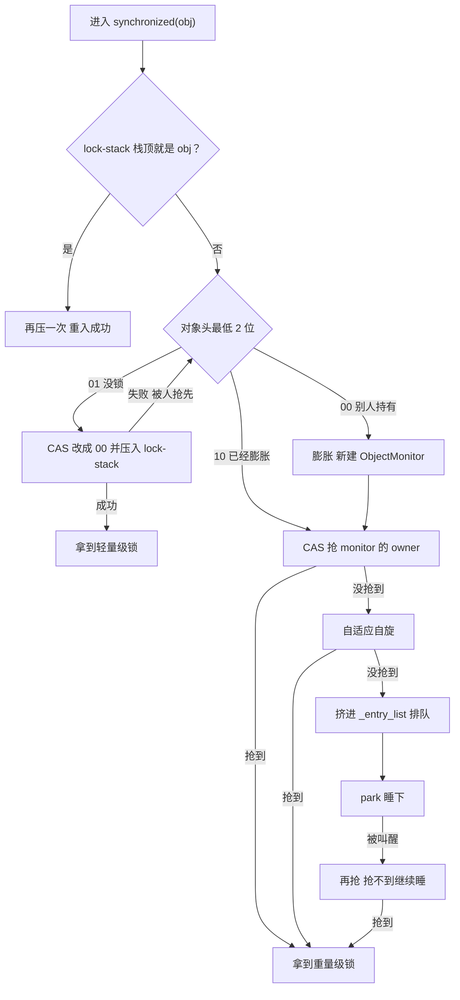
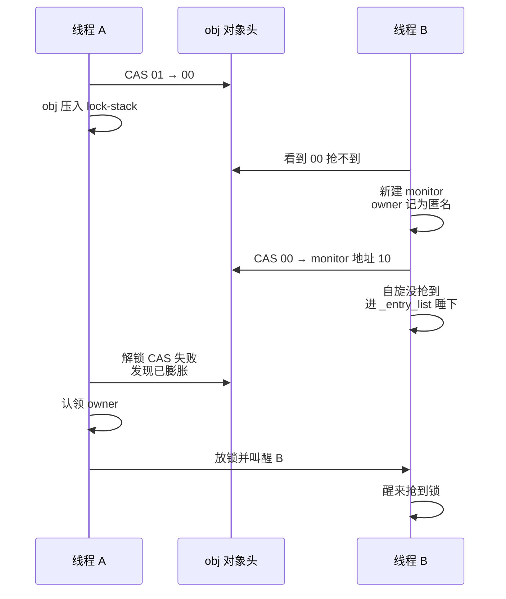
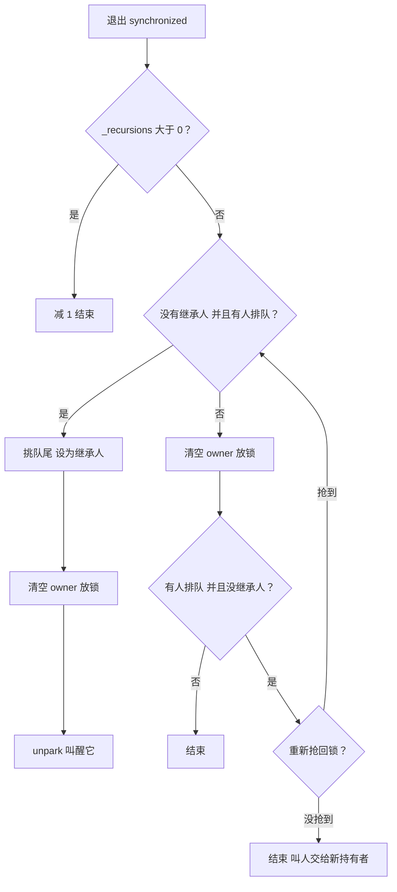
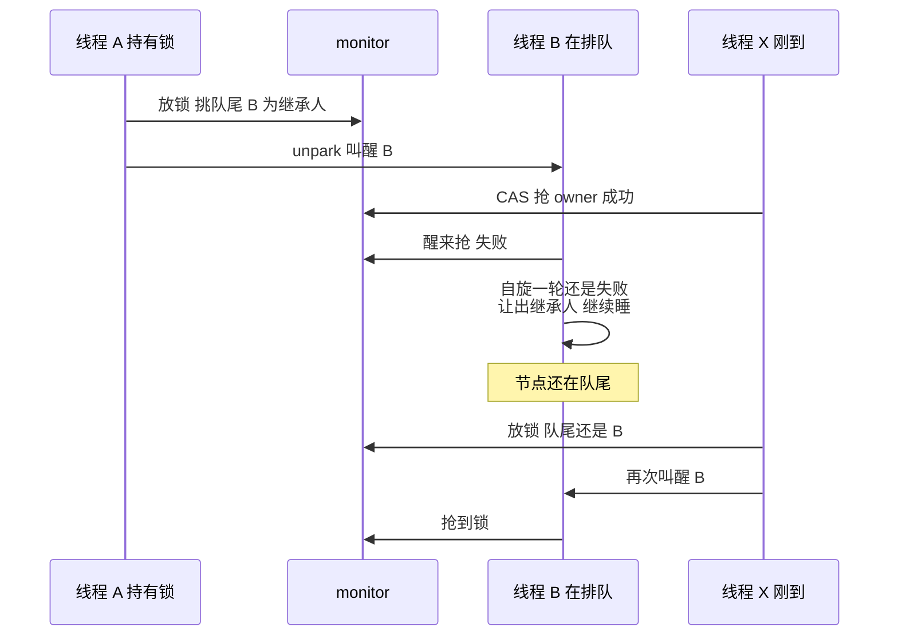
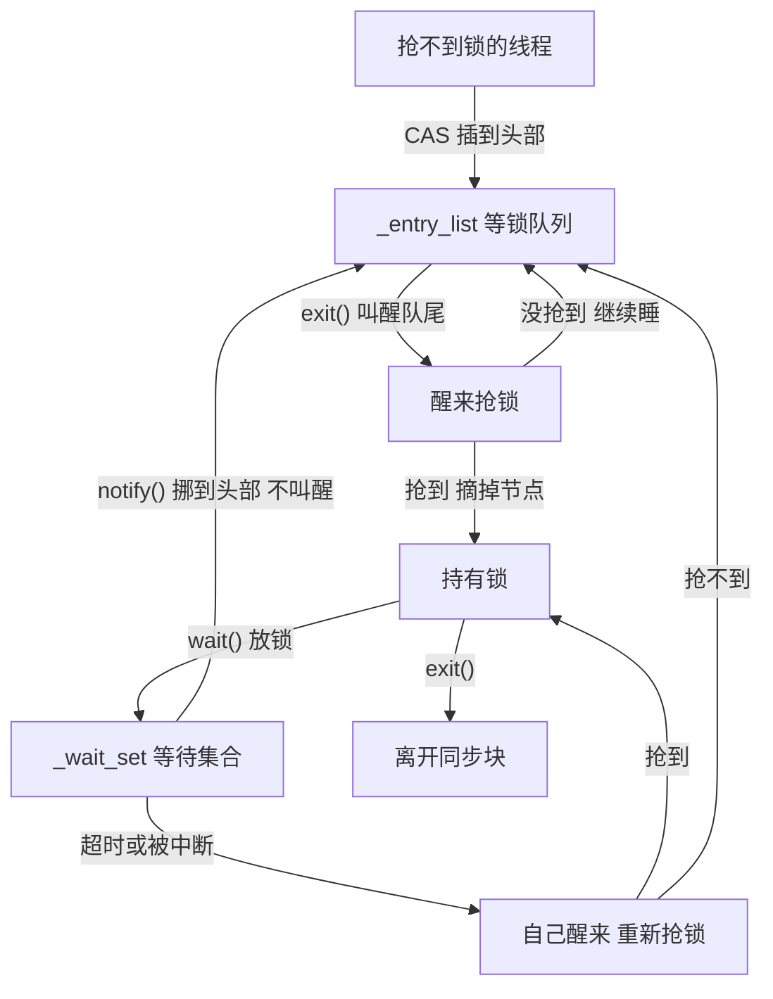

# synchronized 锁升级与工作流程（JDK 25）

::: info 阅读说明
- 以 **JDK 25（LTS）默认配置**的 64 位 HotSpot 为主线：新轻量级锁、ObjectMonitorTable 默认关、紧凑对象头默认关
- 每一步都对照了 JDK 25 源码（`lightweightSynchronizer.cpp`、`objectMonitor.cpp`），关键处贴了简略源码，括号里标了函数名，方便自己去翻
- JDK 21、JDK 27 和本文不一样的地方见文末[版本差异](#版本差异)；各版本的完整变化见[《synchronized 版本演进》](./synchronized-versions)
:::

## 先认识几个词

| 术语 | 通俗解释 |
|---|---|
| Mark Word | 每个对象开头的 8 个字节，记着 hash、GC 年龄等，最低 2 位是**锁标志位** |
| 锁标志位 | `01` 没锁，`00` 轻量级锁，`10` 重量级锁 |
| CAS | 比较并交换。CPU 保证一次做完的操作："这个值如果还是 A，就改成 B；不是就告诉我失败"。几个线程同时改，只有一个能成功，不用加锁 |
| 自旋 | 抢不到锁先不睡，在 CPU 上空转一小会儿再抢，赌锁马上会被放掉。省掉"睡下再叫醒"的开销，代价是占着 CPU |
| park / unpark | 让线程真正睡下 / 把它叫醒。要经过操作系统，比自旋慢得多 |
| 轻量级锁 | 没人抢时用的锁，只改对象头的锁标志位 |
| lock-stack | 每个线程自带的小数组，最多 8 格，记"我手上有哪些轻量级锁" |
| 膨胀 | 有人来抢（或者调用了 `wait()`），给对象配一个 ObjectMonitor，升级成重量级锁 |
| ObjectMonitor | 重量级锁的"管理员"，记着锁归谁、谁在排队、谁在 `wait()` |
| 重入 | 已经拿着这把锁的线程，又进入同一把锁的 `synchronized` |
| 继承人（`_succ`） | 一个"已经有人会来抢锁了"的标记，放锁的线程看到它就不用再叫人。**不代表锁归它**，它醒来照样得自己抢 |
| 安全点 | JVM 让所有 Java 线程停下来的时刻，比如 GC 的某些阶段 |
| 内存屏障 | 一种让 CPU 保证"前面写进去的值，别的线程马上能读到"的操作 |
| 虚拟线程 / 载体线程 | 虚拟线程是 JDK 21 起的轻量线程，实际跑在底下的平台线程（载体线程）上 |

## 全流程一张图

::: warning 先说一句，免得和你的旧印象对不上
下面这张图里等锁队列**只有一条** `_entry_list`。如果你之前看的是 `_cxq` + `_EntryList` 两条队列的讲法，那是 **JDK 24 及以前**的实现 —— JDK 25 把两条合并成了一条，叫醒顺序也跟着变了，见文末[版本差异](#版本差异)。
:::



下面按这张图一步步拆开讲。

## 第 1 步：没人抢，用轻量级锁

### 加锁

（`LightweightSynchronizer::enter`）

1. **先看是不是重入**：lock-stack 没满，并且栈顶正好是 obj，就再压一次，直接成功，不做 CAS
2. **对象没锁（`01`）**：CAS 把最低 2 位改成 `00`，再把 obj 压进 lock-stack
   - lock-stack 满了（8 格）：先把栈里"已经被别人膨胀了"的锁交接成正式的重量级锁，腾出位置；还是满，就把栈底最早拿到的那把锁膨胀掉
3. **对象被别人锁着（`00`）**：进入第 2 步，膨胀

对象头只改了 2 位，hash、GC 年龄都原地不动。锁归谁，对象头里不记，记在线程自己的 lock-stack 里。

### 重入

```text
synchronized (a) {              // lock-stack: [a]
    synchronized (a) {          // lock-stack: [a, a]
        synchronized (b) {      // lock-stack: [a, a, b]
            synchronized (a) {  // 栈顶是 b，不是 a
```

- **第 2 层**：栈顶是 a，连续重入，再压一次，不做 CAS
- **第 4 层**：栈顶是 b，中间夹了别的锁，a 膨胀成重量级锁；lock-stack 里的两个 a 挪走，改由 monitor 记重入次数

### 解锁

（`LightweightSynchronizer::exit`）

1. lock-stack 栈顶两格都是 obj：重入退出，弹掉一格就行
2. 否则 CAS 把 `00` 改回 `01`，从 lock-stack 删掉 obj
3. CAS 失败：说明对象已经被别人膨胀了，改走重量级锁的解锁（见第 2 步最后）

::: tip 为什么叫"轻量"
整个过程只有 CAS 和线程自己的一个小数组，不创建任何对象，也不涉及操作系统。
:::

## 第 2 步：有人抢，膨胀成重量级锁

### 谁会触发膨胀

- 线程加锁时，发现对象被**别人**轻量级锁住了
- 非连续重入（上面例子里的第 4 层）
- lock-stack 满了，要腾位置
- 在对象上调用 `wait()`：等待队列只有 ObjectMonitor 才有，所以一定会膨胀。`notify()` 不会：对象还没膨胀，说明不可能有人在 `wait()`，直接返回

### 膨胀过程

（`LightweightSynchronizer::inflate_into_object_header`）

线程 B 发现对象头是 `00`，被线程 A 锁着：

1. 新建一个 ObjectMonitor，把对象头的原内容（hash、年龄）存进去
2. owner 记成**匿名**：B 不知道锁在谁手里，因为新轻量级锁的对象头里本来就不记持有者
3. CAS 把对象头从 `00` 换成 `monitor 地址 | 10`
   - **成功**：膨胀完成
   - **失败**：对象头变了，比如 A 恰好解锁了。B 删掉刚建的 monitor，重新看对象头：已经是 `10` 就直接用现成的；变成了没锁，就重新膨胀一次，这次 owner 是空的，B 进去一抢就拿到
4. B 进入 ObjectMonitor 抢锁（第 3 步）

JDK 25 默认配置下，B 发现锁被别人拿着，**不自旋，直接膨胀**。膨胀前先自旋只在开启 ObjectMonitorTable 时才有，JDK 27 起默认开启。

### A 解锁时认领 owner

A 想用 CAS 把 `00` 改回 `01`，会失败，于是：

1. 从对象头拿到 monitor，发现 owner 是匿名
2. 在自己的 lock-stack 里找到 obj，确认是自己的锁，把 owner 改成自己；lock-stack 里 obj 有几个，就换算成重入次数
3. 按重量级锁的方式解锁（第 4 步），叫醒 B



::: warning 膨胀后不会马上变回来
就算后来没人抢了，对象也一直是重量级锁，直到后台线程把空闲的 monitor 回收掉（第 7 步）。
:::

## 第 3 步：重量级锁怎么抢

### ObjectMonitor 里有什么

（`objectMonitor.hpp`）

| 字段 | 通俗解释 |
|---|---|
| `_owner` | 锁归谁，存线程 ID。0 表示没人，1 表示匿名，2 表示正在被回收 |
| `_recursions` | 重入次数，第一次进入是 0 |
| `_entry_list` | **等锁队列**的头：抢不到锁的线程在这里排队 |
| `_entry_list_tail` | 等锁队列的尾：最早来排队的那个 |
| `_succ` | 继承人：标记"已经有人会来抢锁了"，让放锁的线程省掉一次无谓的唤醒 |
| `_wait_set` | **等待集合**：调用了 `wait()` 在休息的线程 |
| `_contentions` | 正在抢这把锁的线程数，回收时用来判断能不能回收 |

### 抢锁过程

（`ObjectMonitor::enter` → `enter_internal`）

最顺的两条路，一步到位：

- **直接抢**：CAS 把 `_owner` 从 0 改成自己的线程 ID，成功就拿到锁
- **重入**：`_owner` 就是自己，`_recursions` 加 1

抢不到才往下走。先看一眼整条路，一个线程从进 monitor 到真正睡下，抢锁的机会比想象中密集：

```text
enter
├─ try_enter        ← 抢 ①（顺带查重入）
├─ try_spin         ← 自旋第 1 轮
└─ enter_internal
     ├─ try_lock    ← 抢 ②
     ├─ try_spin    ← 自旋第 2 轮
     ├─ 入队        ← CAS 失败时顺手 try_lock，抢 ③
     ├─ try_lock    ← 抢 ④：park 之前最后一次
     ├─ park        ← 真正睡下
     └─ 醒来：try_lock → try_spin → 还不行接着睡
```

**为什么要试这么多次？** 因为往下走的每一步都贵得多：入队要 new 节点、CAS 改链表；park 要陷内核，一睡一醒是**微秒级**。而 `try_lock` 就是一次 CAS，**纳秒级**。成本差几个数量级，所以每跨一道门槛之前都值得再看一眼。

下面把自旋和排队这两段拆开讲。

### 自适应自旋（`try_spin`）

**先说为什么要转。** 抢不到锁只有两条路：park 睡下要陷内核，微秒级；自旋是占着 CPU 空转，一圈就读一次 `_owner`，纳秒级。锁要是马上就放（同步块里就一行 `count++`），转几百圈就等到了，比睡一觉便宜几个数量级。可要是持有者在里面干 IO，转多久都是白烧 CPU。

**麻烦在于 JVM 事先不知道这把锁是"短"还是"长"。** 所以它不猜，改成看**这把锁过去的成绩** —— 这就是"自适应"。

每个 ObjectMonitor 自带一个计数器 `_SpinDuration`，意思是"**这把锁值得转多少圈**"，开局给 5000（乐观）。转着转着抢到了就调高，转满了还没抢到就调低：

```c
adjust_up(x)                            adjust_down(x)
  x >= 5000        → 不动                 x -= 200，最低到 0
  1000 <= x < 5000 → x + 100
  x < 1000         → 拉到 1000 再 +100 = 1100
```

三个数字背后各有讲究：

- **为什么抢到了要往上加？** 因为 `adjust_down` 只会减 —— 成功时不加，这个值就是个只降不升的棘轮，早晚归零，自适应就废了。而且它**只知道成功、不知道多快成功**（源码里 `CONSIDER: factor "ctr" into the _SpinDuration adjustment` 至今还是个待办），说不定这次是转到 4900 圈才险险抢到，下次就不够用。信息不足时，成功了就往上试探一点最稳。
- **为什么加 100 却减 200？** 多转 100 圈的成本是几十纳秒，多成功一次省下的是几微秒，赔率差两三个数量级。所以**试探小步走，止损大步退**。
- **为什么跌破 1000 直接拉回 1100？** 恢复要快。锁一旦不挤了，得立刻重新享受自旋的好处，而不是 +100 慢慢往回爬。

**一圈到底转什么？** 就是普通读一次 `_owner`，读到 0 才发 CAS：

```c
int64_t ox = owner_raw();              // 普通读 —— 一圈的主体就这一句
if (ox == NO_OWNER) { /* CAS 去抢 */ }
```

先读再 CAS 叫 **TATAS**。要是上来就狂 CAS，每次都得把缓存行抢成独占，几个自旋线程能把总线打爆；普通读是共享的，各读各的缓存，互不打扰。

**另外还有固定的 10 次，无条件先试**，哪怕 `_SpinDuration` 已经是 0。源码给的理由是防止 0 变成 absorbing state（吸收态）：调高的唯一途径是自旋成功，一旦被罚到 0 就不再自旋、永远抢不到、永远是 0 —— 哪怕这把锁后来空得很。所以留 10 次保底采样，给它翻身的机会。

**三种退出方式**，罚不罚分完全不同：

| 怎么出来的 | 源码措辞 | `_SpinDuration` |
|---|---|---|
| 抢到锁了 | —— | `adjust_up`，+100 或跳到 1100 |
| **转满了**还没抢到 | failure **with** prejudice | `adjust_down`，-200 |
| 中途 break | failure **without** prejudice | **不动** |

中途 break 有三种情况：看到锁空了但 CAS 输了、持有者换人了（`ox != prv`）、JVM 要进安全点（每 256 圈查一次）。

**为什么这三种不罚？** 因为它们证明不了"这把锁不适合自旋"，只是撞上了运气或者外部原因，罚下去就冤枉它了。只有老老实实转满还没等到，才算真凭实据。

::: tip 顺便说清楚"继承人"（`_succ`）
自旋的时候会把自己登记成继承人：`if (!has_successor()) set_successor(current);`

容易误会成"锁预定给它了"，**不是**。源码原话：`The exiting thread does not grant or pass ownership to the successor thread.`

它就是一个标记：**已经有一个醒着的线程会来抢锁了，放锁的人不用再费劲叫人。** 放锁的线程一看 `_succ` 非空就直接走，省掉一次 unpark（系统调用 + 上下文切换）。字段注释管这叫 futile wakeup throttling —— 掐掉白跑一趟的唤醒。

能当继承人的有两种：**正在自旋的**（本来就醒着），和**放锁时从队尾挑中、刚被 unpark 的**（正在醒来的路上）。名额**只有一个**，够用了 —— 源码：`We need only one such successor thread to guarantee progress.`

**那自旋的人一直占着，队列里的岂不是永远醒不来？** 不会。自旋是有限的，转完必定 `clear_successor()` 让位，然后自己去排队。更关键的是：越挤，自旋失败越多，`_SpinDuration` 越快被罚到 0，而那 10 次保底里**根本不设 `_succ`** —— 竞争一激烈，自旋就自动退出舞台了。
:::

### 排队和睡下

自旋也没抢到，才真去排队。这一段有**三个不同时机**的动作，别串成一条连续流程看：

**① 进队前：再抢一次、再转一轮**

```c
// enter_internal 开头
if (try_lock(current) == TryLockResult::Success) return;   // 再抢一次
// We try one round of spinning *before* enqueueing current.
if (try_spin(current)) return;                             // 再转一轮
// The Spin failed -- Enqueue and park the thread ...
```

前面 `enter` 里明明已经抢过、转过了，为什么又来一遍？因为这两段中间隔着事 —— 要给 `_contentions` 加 1（防止 monitor 被并发回收）、要查 monitor 是不是正在被回收。这期间锁完全可能已经放了，不看白不看。

**② 入队时：CAS 失败就顺手抢一下**

把自己包成节点（`ObjectWaiter`），CAS 插到 `_entry_list` **头部**：

```c
for (;;) {
  ObjectWaiter* head = Atomic::load(&_entry_list);
  node->_next = head;
  if (Atomic::cmpxchg(&_entry_list, head, node) == head) return false;  // 入队成功
  // CAS 失败说明别人也在插队 —— 那锁说不定刚放了，先抢一下
  if (try_lock(current) == TryLockResult::Success) return true;
}
```

**③ park 之前：必须再抢一次**

前两次是划算不划算的问题，这一次是**正确性**问题。源码注释：

> The lock might have been released while this thread was occupied queueing itself onto `_entry_list`. To close the race and avoid **"stranding"**...

我刚入队、还没睡，恰好此时持有者放锁 —— 如果它读 `_entry_list` 的时刻在我入队**之前**（看到是空的），它就直接走了，没人叫我，我一 park 就永久睡死（stranding，搁浅）。所以必须"先入队，再回头看一眼锁"。

**睡下**：park。这时 `jstack` 看到的状态是 `BLOCKED`。

**醒来**：再抢一次 → 抢不到再转一轮 → 还不行就让出继承人身份，继续睡。抢到了才把自己的节点从 `_entry_list` 摘掉（`unlink_after_acquire`）。

### 等锁队列长什么样

源码 `objectMonitor.cpp` 开头的注释里就有这个例子：

```text
A、B、C 依次来排队，每个都 CAS 插到头部：
    _entry_list → C → B → A          队尾是 A（最早来的）

放锁时从队尾挑人：叫醒 A
A 抢到锁，把自己摘掉：
    _entry_list → C → B              队尾变成 B

这时 D 来排队，照样插到头部：
    _entry_list → D → C → B          下一个被叫醒的还是 B
```

- **插入**：新线程只管往头部插，用 CAS 就行，不用加锁
- **找队尾、摘节点**：只有持有锁的线程能做。刚插进来的节点只有向后的指针，放锁的线程找队尾时顺着走一遍，顺便把反向指针补上

::: details 虚拟线程排的是同一条队，但上下队的方式完全不同（JDK 24 起，JEP 491）
**把载体线程想成工位，虚拟线程是员工，工位比员工少得多。**

平台线程自带工位，抢不到锁就趴在工位上睡，工位空占着。虚拟线程不一样：抢不到锁时它**收拾东西走人** —— 把栈上的数据存进堆里（freeze），工位腾给别人用。

顺序有讲究，是**先收拾、后排队**：

```c
// enter_with_contention_mark
result = Continuation::try_preempt(current, ce->cont_oop(current));  // ① 先 freeze 栈帧到堆
if (result == freeze_ok) {
    vthread_monitor_enter(current);                                  // ② 再入队
    return;                                                          // ③ 回 Java 层完成卸载
}
// freeze 失败 → 往下掉，走平台线程那套 park → 这就是"钉住"(pinned)
```

因为 freeze 可能失败（栈上有 native frame，比如卡在 JNI 里就下不来），得先确认自己走得了，再去占队列的位置。

麻烦的是轮到它拿锁时，**它人都不在公司，没法直接拍醒**。所以放锁的线程只做两件事：把它的名字写到"待解锁名单"上，然后按一下 unblocker 的铃：

```c
// exit_epilog 的虚拟线程分支
set_successor(vthread);                                     // 继承人是 vthread 对象，不是 JavaThread
if (java_lang_VirtualThread::set_onWaitingList(vthread, vthread_list_head())) {
  ObjectMonitor::vthread_unparker_ParkEvent()->unpark();    // 按铃，不是叫载体线程
}
```

真正把它**交回调度器**的是 unblocker 那个专职线程：

```java
// VirtualThread.java，线程名就叫 VirtualThread-unblocker
private void unblock() {
    blockPermit = true;
    if (state() == BLOCKED && compareAndSetState(BLOCKED, UNBLOCKED)) {
        submitRunContinuation();      // 交给调度器，池子随便派个空工位
    }
}
```

为什么中间非要隔一个人？因为放锁的线程当时在 JVM 内部（C++ 里），而"交回调度器"是一段 **Java 代码**，它在那个位置不方便执行，这活儿也不该由它承担 —— 它该赶紧回去跑自己的业务。

派哪个载体线程由调度器决定，**跟它走之前坐哪个没关系**。搬回来之后照样得自己抢锁（`resume_operation`），抢不到就再收拾东西走人 —— 非公平那套规矩对虚拟线程一视同仁。

**代价和收益**：这一趟（freeze 拷栈 → 排队 → 转交 → 调度 → thaw 拷回）明显比平台线程的 park/unpark 贵。但平台线程一睡，那个 OS 线程就废在那儿了；虚拟线程卸下来后，工位能接着服务成千上万个别的任务。JDK 21 时虚拟线程在 `synchronized` 里阻塞、或者抢锁抢不到，都会钉住载体线程，是当时最大的坑，JEP 491 解决的就是这个。
:::

## 第 4 步：释放锁

（`ObjectMonitor::exit`）

放锁的线程只需要回答一个问题：**我走了之后，这把锁还有没有人管？**

- **有继承人**：有人管（要么正在自旋，要么刚被叫醒），撒手就走
- **没继承人但有人排队**：没人管，得先叫醒一个

按这个思路分三种情况。

**① `_recursions` 大于 0**：减 1，结束 —— 只是退出一层重入，锁还在自己手上。

**② 没继承人、又有人排队**：先挑好人，再放锁。

```c
if (!has_successor()) {
  ObjectWaiter* w = Atomic::load(&_entry_list);
  if (w != nullptr) {
    w = entry_list_tail(current);   // 从队尾挑，也就是最早来排队的那个
    exit_epilog(current, w);        // 设继承人 → 放锁 → unpark 叫醒它
    return;
  }
}
```

**③ 其他情况**：先放锁，再回头看一眼。

```c
release_clear_owner(current);       // 先放锁
OrderAccess::storeload();           // 屏障：保证下面读到的是别的 CPU 刚写的值

if (_entry_list == nullptr || has_successor()) {
  return;                           // 没人排队，或已经有人接手 → 走人
}
// 有人排队又没继承人：放锁这一瞬间有人进队了，或者原来的继承人放弃了
if (try_lock(current) != TryLockResult::Success) {
  return;                           // 抢不回来 → 锁已被别人拿走，叫人的事交给新持有者
}
// 抢回来了 → 回到 ② 重新挑人
```

**为什么 ② 是"先挑人再放锁"，③ 却是"先放锁再看"？** ② 已经确定没人管了，挑人这件事躲不掉，不如趁还持有锁的时候做完 —— 只有持锁的线程能动队列。而 ③ 是乐观路径，大概率没人排队或者已经有人接手，先把锁放了让别人能用，对吞吐最有利。



### 叫醒不等于把锁交给它

源码里管这叫**竞争式交接**：放锁的线程只负责叫醒继承人，不直接把锁交到它手上。继承人醒来还得自己抢，这时刚到的线程也可能在抢（它排队前会先抢、先自旋），谁先 CAS 成功算谁的。

所以 synchronized 是**非公平锁**。好处是正在 CPU 上跑的线程可以直接拿锁，不用等一个睡着的线程被系统叫醒，整体吞吐更高。



### 为什么不会"没人叫"

放锁和排队的顺序正好相反：

- **排队的线程**：先进队，再看锁（睡前再抢一次）
- **放锁的线程**：先放锁，再看队（第 3 种情况）

两边至少有一方能看到对方：要么放锁的看到有人排队去叫人，要么排队的看到锁空了直接抢走。为了保证另一个 CPU 真能按这个顺序看到写入，放锁后还加了一次内存屏障（`OrderAccess::storeload()`）。

## 第 5 步：wait / notify / notifyAll

### wait()

（`ObjectMonitor::wait`）

1. 没持有锁：抛 `IllegalMonitorStateException`
2. 线程已经被中断：直接抛 `InterruptedException`，锁不放
3. 把自己包成节点，加到 `_wait_set` **队尾**
4. 记下重入次数，清零，调用第 4 步的 exit **一次性把锁放掉**，重入几层都放。放锁时会按规则叫醒排队的人
5. park 睡下，线程状态是 `WAITING`；`wait(毫秒)` 是 `TIMED_WAITING`
6. 醒来之后分两种情况：
   - **被 notify 过**：节点已经被挪进 `_entry_list`，按排队线程的方式重新抢锁
   - **超时、被中断、或者无缘无故醒了**（叫虚假唤醒）：节点还在 `_wait_set`，自己摘出来，按普通抢锁流程重新进入
7. 抢回锁后，恢复原来的重入次数。如果没被 notify、而是被中断醒的，抛 `InterruptedException`

::: warning 一定要用 while 包住 wait()
源码注释写明虚假唤醒按超时处理，`wait()` 返回不代表条件已经满足：

```java
synchronized (lock) {
    while (!ready) {
        lock.wait();
    }
}
```
:::

### notify()

（`ObjectMonitor::notify_internal`）

1. 没持有锁：抛 `IllegalMonitorStateException`
2. 从 `_wait_set` 取出**最早** wait 的那个节点
3. 标记为"已通知"，用 CAS 插到 `_entry_list` 头部，线程状态变成 `BLOCKED`
4. **不叫醒它**：调用 notify 的线程还拿着锁，叫醒了也抢不到，白醒一次。等 notify 的线程退出同步块，由 exit 按顺序叫醒

插到头部意味着：被 notify 的线程要排在**已经在等锁的线程后面**。

### notifyAll()

把 `_wait_set` 里的节点一个个挪进 `_entry_list`。源码注释里的例子：

```text
_wait_set:   A B C D（A 最早 wait）
_entry_list: X → Y → Z（Z 最早来排队）

notifyAll 之后：
_entry_list: D → C → B → A → X → Y → Z
没有新线程插队的话，叫醒顺序：Z、Y、X、A、B、C、D
```

### 一次完整的 wait / notify


## 第 6 步：两个队列怎么流转



| 线程在做什么 | `jstack` 看到的状态 |
|---|---|
| 在 `_entry_list` 里等锁 | `BLOCKED (on object monitor)` |
| 在 `_wait_set` 里 `wait()` | `WAITING (on object monitor)` |
| 在 `_wait_set` 里 `wait(毫秒)` | `TIMED_WAITING (on object monitor)` |
| 被 notify 后等着重新抢锁 | `BLOCKED (on object monitor)` |

## 第 7 步：空闲回收，锁也会"降级"

（`ObjectMonitor::deflate_monitor`）

- **谁来做**：后台有一个 `Monitor Deflation Thread` 线程专门干这件事
- **什么时候做**：在用的 monitor 超过上限的 90% 时，最快每 250 毫秒一次；不管用了多少，至少每 60 秒一次
- **能回收的条件**：没人持有、没人排队、没人 `wait()`、没人正在抢
- **回收过程**：
  1. CAS 把 `_owner` 从 0 改成"正在回收"的标记
  2. 再确认没人来抢：CAS 把 `_contentions` 从 0 改成负数
  3. 把 monitor 里存的原对象头写回对象，对象恢复成没锁（`01`）
- **撞上回收怎么办**：两次 CAS 中间要是有线程来抢，回收就放弃；抢锁的线程如果撞见已经回收完的 monitor，会重新走一遍加锁流程

## 版本差异

| 环节 | JDK 21（LTS） | JDK 25（本文） | JDK 27 |
|---|---|---|---|
| 偏向锁 | 没有 | 没有 | 没有 |
| 轻量级锁 | 默认传统栈锁：对象头整个换成栈上 Lock Record 地址 | lock-stack，只改锁标志位 | 同 JDK 25 |
| 膨胀 | 要经过 `INFLATING` 中间状态；不自旋 | owner 先记匿名；默认不自旋 | 默认先自旋，最多 CAS 8 次 |
| monitor 放哪 | 对象头存 monitor 地址 | 对象头存 monitor 地址 | 单独的 ObjectMonitorTable，对象头不动 |
| 持有者 `_owner` | 线程指针或 Lock Record 地址 | 线程 ID | 线程 ID |
| 等锁队列 | `_cxq` + `_EntryList` 两条 | 一条 `_entry_list`，先来先叫醒 | 同 JDK 25 |
| notify 挪到哪 | `_EntryList` 为空就放进去，否则插 `_cxq` 头部 | 插 `_entry_list` 头部 | 同 JDK 25 |
| 防止没人叫醒 | 指定一个 `_Responsible` 线程定时醒来检查 | 放锁后加内存屏障 | 同 JDK 25 |
| 放锁时挑人 | 先放锁，再看队列 | 有人排队且没继承人时，先挑好人再放锁 | 同 JDK 25 |

::: details JDK 21 的 _cxq 和 _EntryList 怎么流转（JDK 24 及以前都是这套）
两条队列的分工：`_cxq` 是"新人入口"，`_EntryList` 是"正式队伍"。

- **入队**：抢不到锁的线程 CAS 插到 `_cxq` **头部**
- **放锁挑人**：`_EntryList` 不为空，就叫醒它的**头节点**；空了，才把 `_cxq` 整条**摘下来**（不是复制）挂成新的 `_EntryList`，顺序不变，再叫醒头节点

```c
// JDK 21 exit：两处都是挑 _EntryList 的 head
w = _EntryList;  if (w != nullptr) { ExitEpilog(current, w); return; }
...
// Drain _cxq into EntryList - bulk transfer.    ← _EntryList 空了才搬
```

关键差别在**挑哪一头**：两个版本入队都是头插，但 JDK 21 挑 head（那批里最晚来的），JDK 25 挑 tail（全局最早来的）。

同一批线程按 B→C→D→E→F→G 的顺序来抢，两边叫醒顺序完全不同：

```text
JDK 21（B C D 已搬进 _EntryList，E F G 还堆在 _cxq）
    _cxq        → G → F → E
    _EntryList  → D → C → B
    挑 head：D、C、B → 队伍空了才搬 _cxq → 再挑 head：G、F、E
    叫醒顺序：D C B G F E       批内后来的先醒，批间先来的先醒

JDK 25（只有一条队，E F G 也头插到同一条上）
    _entry_list      → G → F → E → D → C → B
    _entry_list_tail ---------------------^
    挑 tail：B、C、D、E、F、G
    叫醒顺序：B C D E F G       严格先来先醒
```

注意"叫醒顺序"不等于"拿到锁的顺序" —— 竞争式交接，被叫醒的还得自己抢，随时可能被刚到的线程截胡。
:::

::: details 偏向锁（JDK 6 ~ 14 默认开启，了解即可）
- 开启后新对象是"匿名偏向"：对象头里线程指针为 0
- 第一次加锁：CAS 把自己的线程指针写进对象头
- 之后同一个线程再进出：只比较对象头，不做 CAS，不写内存
- 别的线程来抢、或者计算了对象的原始 hash（`Object.hashCode()` / `System.identityHashCode()`）：撤销偏向，变成轻量级锁或无锁
- JDK 15 默认关闭，JDK 18 删除代码，详见[《synchronized 版本演进》](./synchronized-versions)
:::

## 参考源码

**JDK 25**

- [lightweightSynchronizer.cpp](https://github.com/openjdk/jdk/blob/jdk-25-ga/src/hotspot/share/runtime/lightweightSynchronizer.cpp)：轻量级锁加锁、解锁、膨胀
- [objectMonitor.cpp](https://github.com/openjdk/jdk/blob/jdk-25-ga/src/hotspot/share/runtime/objectMonitor.cpp)：抢锁、排队、放锁、wait / notify、回收，开头有队列设计的注释
- [objectMonitor.hpp](https://github.com/openjdk/jdk/blob/jdk-25-ga/src/hotspot/share/runtime/objectMonitor.hpp)：ObjectMonitor 的字段
- [lockStack.inline.hpp](https://github.com/openjdk/jdk/blob/jdk-25-ga/src/hotspot/share/runtime/lockStack.inline.hpp)：lock-stack 的重入判断
- [synchronizer.cpp](https://github.com/openjdk/jdk/blob/jdk-25-ga/src/hotspot/share/runtime/synchronizer.cpp)：wait / notify 入口、回收触发条件

**对照版本**

- [JDK 21 objectMonitor.cpp](https://github.com/openjdk/jdk/blob/jdk-21-ga/src/hotspot/share/runtime/objectMonitor.cpp)：`_cxq`、`_EntryList`、`_Responsible`
- [JDK 27 synchronizer.cpp](https://github.com/openjdk/jdk/blob/jdk27/src/hotspot/share/runtime/synchronizer.cpp)：默认开启 ObjectMonitorTable 后的自旋
- [JEP 491: Synchronize Virtual Threads without Pinning](https://openjdk.org/jeps/491)
