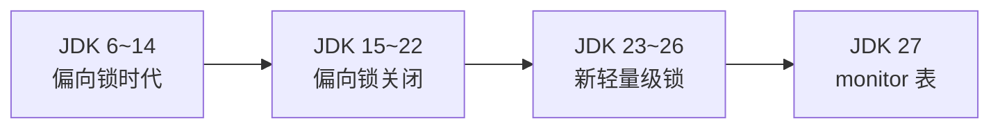
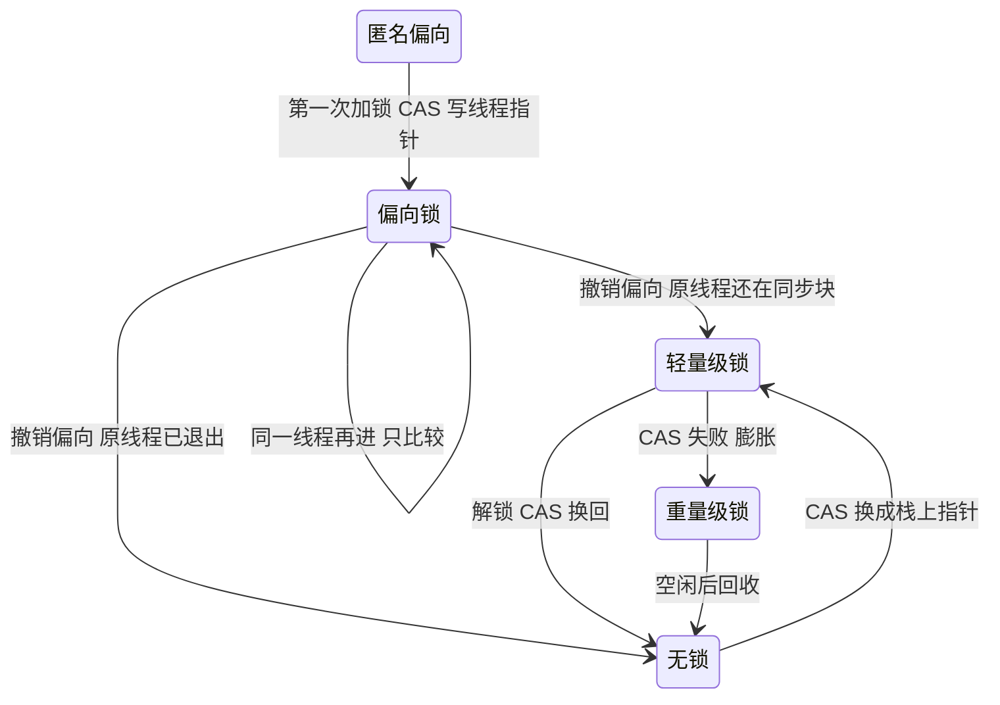
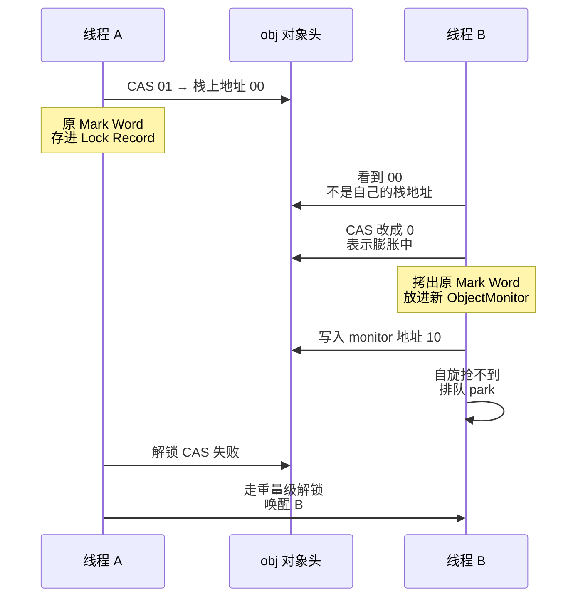
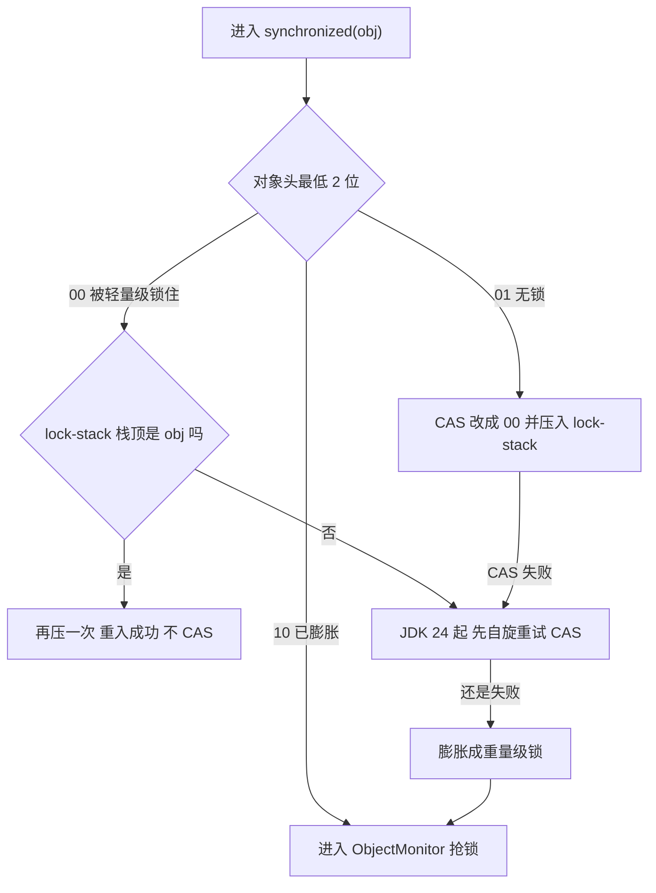
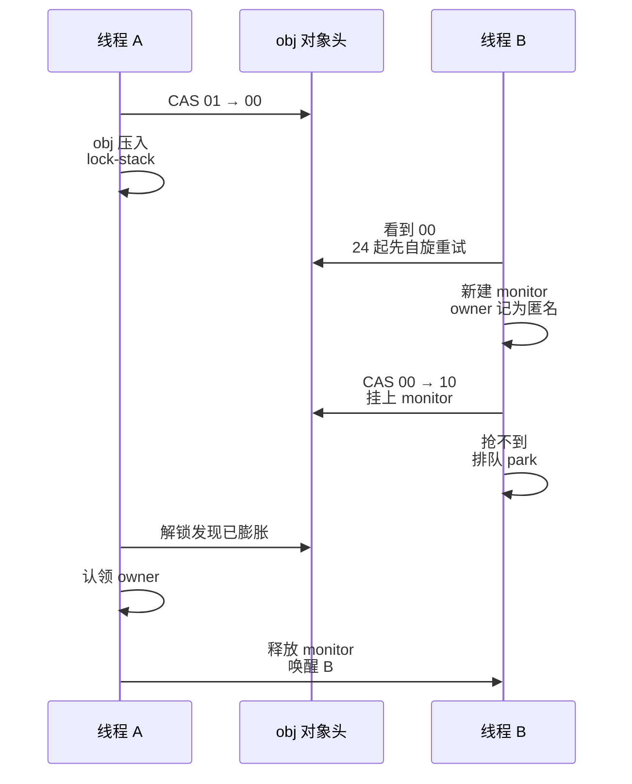
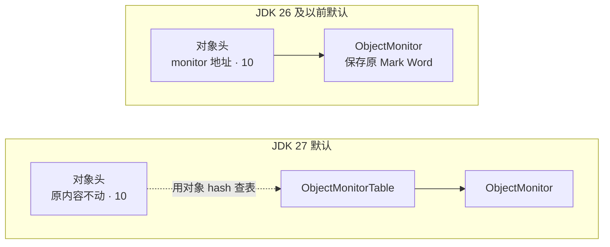

# synchronized 锁升级：从 JDK 6 到 JDK 27

::: info 阅读说明
- 以 64 位 HotSpot JVM 为准
- 版本号指改动第一次进入正式版（GA）的版本
- 关键结论都附了 JEP / JBS 编号或源码位置，文末有链接
- 最后核对：2026-09，JDK 27 刚发布
:::

## 先看结论

- **JDK 6 ~ 14**：无锁 → 偏向锁 → 轻量级锁 → 重量级锁，常见面试题说的就是这一版
- **JDK 15 ~ 22**：偏向锁默认关闭，变成无锁 → 轻量级锁 → 重量级锁
- **JDK 23 ~ 26**：还是三段，但轻量级锁换了新实现，加锁只改对象头的 2 个锁标志位
- **JDK 27**：紧凑对象头默认开启，膨胀后的 monitor 默认不再写进对象头，而是放进一张单独的表



## 版本改动总表

| JDK | 改动 | 出处 |
|---|---|---|
| 6 | 偏向锁默认开启；引入自适应自旋 | Java SE 6 性能白皮书 |
| 8 | 偏向锁默认开启，但 JVM 启动 4 秒后才生效 | `BiasedLockingStartupDelay=4000` |
| 10 | 偏向锁启动延迟默认改为 0 | JDK-8180421 |
| 14 | 撤销偏向改用只针对单个线程的 handshake，不再停顿所有线程 | JDK-8191890 |
| 15 | 偏向锁默认关闭，相关参数废弃；空闲 monitor 改为异步回收 | JEP 374、JDK-8153224 |
| 16 | 删掉在安全点里回收 monitor 的旧机制 | JDK-8246476 |
| 18 | 偏向锁参数被忽略，偏向锁代码删除 | JDK-8256425 |
| 19 | 偏向锁参数彻底删除，再加这个参数 JVM 直接启动失败 | `arguments.cpp` |
| 21 | 新轻量级锁以实验参数出现：`-XX:LockingMode=2` | JDK-8291555、JDK-8305999 |
| 22 | `LockingMode` 转为正式参数 | JDK-8315061 |
| 23 | 默认改用新轻量级锁；支持连续重入 | JDK-8319251、JDK-8319796 |
| 24 | `LockingMode` 废弃；轻量级锁膨胀前先自旋；新增 ObjectMonitorTable（默认关）；虚拟线程不再被 synchronized 钉住；紧凑对象头（实验） | JDK-8334299、JDK-8315884、JEP 491、JEP 450 |
| 25 | 紧凑对象头转正（默认关）；monitor 的两条等待队列合并成一条 | JEP 519、JDK-8343840 |
| 26 | `LockingMode` 被忽略，传统栈锁代码删除 | JDK-8359437 |
| 27 | 默认开启紧凑对象头和 ObjectMonitorTable | JEP 534、JDK-8379782 |
| 28 | （开发中）计划删除 `UseObjectMonitorTable` 参数和"对象头存 monitor 地址"的代码 | JDK-8389325 |

::: tip HotSpot 参数下线的三个阶段
源码 `arguments.cpp` 里的规则：

- **废弃（deprecated）**：参数照样生效，启动时打印警告
- **过时（obsolete）**：参数还能写，但值被忽略，打印警告
- **过期（expired）**：JVM 不认识这个参数，报 `Unrecognized VM option` 启动失败

偏向锁参数：15 废弃 → 18 过时 → 19 过期。`LockingMode`：24 废弃 → 26 过时 → 27 过期。
:::

## 锁状态记在哪

对象头 = **Mark Word**（64 位）+ **类型指针**（开启压缩类指针时 32 位），一共 96 ~ 128 位。锁状态记在 Mark Word 里，看最低 2 位：

| 最低 2 位 | 含义 |
|---|---|
| `01` | 无锁。开着偏向锁时（JDK 6 ~ 14 默认开）还要看倒数第 3 位，是 `1` 表示偏向锁 |
| `00` | 轻量级锁 |
| `10` | 重量级锁，已经膨胀出 ObjectMonitor |
| `11` | GC 标记用 |

## 时期一：JDK 6 ~ 14，偏向锁时代

### 对象头布局

64 位 Mark Word，JDK 8 的 `markOop.hpp` 和 JDK 17 的 `markWord.hpp` 源码注释一致：

| 状态 | 高位 | 偏向位 | 锁标志 |
|---|---|---|---|
| 无锁 | unused:25 · hash:31 · unused:1 · age:4 | `0` | `01` |
| 偏向锁 | `JavaThread*`:54 · epoch:2 · unused:1 · age:4 | `1` | `01` |
| 轻量级锁 | 整个换成指向线程栈上 Lock Record 的指针 | — | `00` |
| 重量级锁 | 整个换成指向 ObjectMonitor 的指针 | — | `10` |

偏向锁生效后，新对象的对象头是**匿名偏向**：线程指针全是 0，偏向位是 1，表示"可以偏向，但还没偏向谁"。

### 升级流程



几个关键点：

1. **偏向锁省掉的是 CAS**：第一次加锁用 CAS 写入线程指针，之后同一个线程进出同步块只读一下对象头比较，不写内存。
2. **无锁态加轻量级锁，每次进出都要 CAS**：退出时对象头恢复成无锁，不会记住上次是谁，下次还得再 CAS。所以"同一线程反复进入无锁对象"不等于变相的偏向锁。
3. **撤销偏向很贵**：别的线程来抢、或者计算了对象的原始 hash（`Object.hashCode()` / `System.identityHashCode()`，对象头放不下线程指针和 hash 两样东西），都要撤销偏向。JDK 13 及以前要进入安全点暂停所有线程，JDK 14 起改用只针对持有偏向的那个线程的 handshake。
4. **轻量级锁不自旋**：CAS 失败直接膨胀。自适应自旋发生在膨胀后的 ObjectMonitor 里，见 JDK 8 源码 `ObjectSynchronizer::slow_enter`。

### 为什么要取消偏向锁

JEP 374 给的理由：

- 受益最大的是 `Hashtable`、`Vector` 这类每次访问都加锁的老集合，现在大家用非同步集合或 Java 5 引入的并发集合
- 一旦出现竞争，撤销偏向的代价很高
- 偏向锁给同步子系统带来大量复杂代码，还侵入了 HotSpot 其他组件

## 时期二：JDK 15 ~ 22，偏向锁关闭

### 偏向锁怎么一步步下线

| 版本 | 加 `-XX:+UseBiasedLocking` 的效果 |
|---|---|
| JDK 15 ~ 17 | 能打开偏向锁，但打印废弃警告 |
| JDK 18 | 参数被忽略，打印警告；偏向锁代码已删除 |
| JDK 19 起 | JVM 启动失败 |

### 轻量级锁：传统栈锁

这个时期的轻量级锁叫 **stack-locking**（源码里 `LockingMode` 为 `LM_LEGACY`）：

1. **加锁**：在当前栈帧里放一个 Lock Record，把原来的 Mark Word 存进去，再用 CAS 把 Mark Word 换成 Lock Record 的地址（栈上地址是对齐的，最低 2 位天然是 `00`）
2. **重入**：发现 Mark Word 指向自己的栈，就再放一个"原 Mark Word 为空"的 Lock Record，不做 CAS
3. **解锁**：Lock Record 里是空的，说明是重入，直接返回；否则 CAS 把原 Mark Word 写回去
4. **竞争**：CAS 失败直接膨胀

::: warning 注意
对象头里存的是**栈上 Lock Record 的地址**，不是线程 ID。判断是不是自己持有，靠的是这个地址落不落在自己的线程栈范围内。
:::

### 两个线程竞争



- **为什么要有 `INFLATING` 中间状态**（对象头临时写成 0）：原 Mark Word 存在 A 的栈上，B 必须在 A 解锁之前把它拷进 monitor。B 抢到 `INFLATING` 之后，A 再解锁 CAS 必然失败，只能等 B 装好 monitor，再走重量级解锁。
- **owner 记的是什么**：B 膨胀时，monitor 的 owner 先记成 A 的 Lock Record 地址，等 A 再操作这个 monitor 时才换成 A 线程本身。

### 这个时期的其他变化

- **JDK 15**：空闲 monitor 改为后台异步回收，不再拖长安全点停顿（JDK-8153224）
- **JDK 16**：删掉在安全点里回收 monitor 的旧机制（JDK-8246476）
- **JDK 21**：可以用 `-XX:+UnlockExperimentalVMOptions -XX:LockingMode=2` 试用新轻量级锁
- **JDK 22**：`LockingMode` 转为正式参数；曾尝试把默认值改成新实现，后来撤回（JDK-8319253）

## 时期三：JDK 23 ~ 26，新轻量级锁成为默认

### 为什么换

- 传统栈锁把指向栈的指针塞进对象头，锁状态随时会改写对象头，想读原始 Mark Word 很麻烦（JDK-8291555）
- 传统栈锁会覆盖整个对象头，和紧凑对象头不兼容（JEP 450）

### 对象头布局

JDK 25 `markWord.hpp`，此时偏向位已经没有了：

| 模式 | 布局（高位 → 低位） |
|---|---|
| 普通对象头 | unused:22 · hash:31 · unused_gap:4 · age:4 · self-fwd:1 · lock:2 |
| 紧凑对象头（24 实验，25 正式，默认关） | klass:22 · hash:31 · unused_gap:4 · age:4 · self-fwd:1 · lock:2 |

| 状态 | Mark Word 内容 |
|---|---|
| 无锁 | 原内容 · `01` |
| 轻量级锁 | **原内容不动** · `00` |
| 重量级锁（默认） | ObjectMonitor 地址 · `10`，原内容挪进 monitor |
| 重量级锁（开启 ObjectMonitorTable） | 原内容不动 · `10`，monitor 去表里查 |

### 加锁、重入、解锁

轻量级锁**只改锁标志位**，锁归谁记在线程自己的 **lock-stack** 里（一个小数组，容量 8）：

1. **加锁**：CAS 把最低 2 位从 `01` 改成 `00`，再把对象压进当前线程的 lock-stack；lock-stack 满了就直接膨胀
2. **重入**（JDK 23 起）：lock-stack 栈顶正好是这个对象，就再压一次，不做 CAS；如果中间夹了别的锁，就膨胀。JDK 21 ~ 22 任何重入都要膨胀
3. **解锁**：栈顶两个都是它，说明是重入，弹一个就行；只有栈顶是它，就 CAS 把 `00` 改回 `01` 再弹出



::: tip 对象不知道谁持有它
新实现里对象头只知道"我被锁了"。要问"是不是我持有"，线程查自己的 lock-stack 就行，很便宜；要问"到底是谁持有"，只能遍历所有线程的 lock-stack，但这种场景很少，比如打印线程转储。
:::

### 两个线程竞争：匿名持有者



- B 膨胀时不知道锁在谁手里，就先把 owner 记成"匿名"，等持有线程出同步块时，在自己的 lock-stack 里找到这个对象，再来认领
- A 解锁和 B 装 monitor 抢的是**同一个 CAS**，期望的旧值都是那个 `00`，只有一个能成功：
  - A 先成功：对象恢复无锁，B 的 CAS 失败，删掉刚建的 monitor 重来
  - B 先成功：A 的轻量级解锁失败，改走上面的认领流程

### JDK 24：虚拟线程不再被钉住（JEP 491）

- **以前**：monitor 记录的持有者是虚拟线程底下的**载体线程**，虚拟线程在 synchronized 里阻塞时没法从载体线程上卸下来，叫"钉住"（pinning）
- **现在**：`ObjectMonitor` 的 `_owner` 从线程指针改成了 `int64_t` 的线程 ID（对比 JDK 23 和 24 的 `objectMonitor.hpp`）。虚拟线程在同步块里阻塞、等锁、调用 `wait()` 都能卸下
- **仍会钉住的少数情况**：比如阻塞在类加载、类初始化里

### JDK 24 ~ 26 的其他变化

| JDK | 变化 |
|---|---|
| 24 | `LockingMode` 废弃 |
| 24 | 轻量级锁膨胀前先自旋：最多 CAS 13 次，每次之间自旋时间指数增长（诊断参数 `LightweightFastLockingSpins`，JDK 26 改名为 `FastLockingSpins`） |
| 24 | 新增 `UseObjectMonitorTable`，诊断参数，默认关 |
| 25 | ObjectMonitor 的 `_cxq` 和 `_EntryList` 两条队列合并成一条 `_entry_list`（JDK-8343840） |
| 26 | `LockingMode` 被忽略，传统栈锁代码删除，只剩新实现 |

## 时期四：JDK 27，紧凑对象头 + ObjectMonitorTable

### 对象头布局

JDK 27 默认开启紧凑对象头，**整个对象头就是 64 位的 Mark Word**，类型指针也压缩进来了。以前是 96 ~ 128 位（JEP 450）。

| 模式 | 布局（高位 → 低位，jdk27 分支 `markWord.hpp`） |
|---|---|
| 紧凑对象头（默认） | klass:22 · hash:31 · valhalla:4 · age:4 · self-fwd:1 · lock:2 |
| 普通对象头 | unused:22 · hash:31 · valhalla:4 · age:4 · self-fwd:1 · lock:2 |

| 状态 | Mark Word 内容 |
|---|---|
| 无锁 | 原内容 · `01` |
| 轻量级锁 | 原内容 · `00` |
| 重量级锁 | 原内容 · `10`，monitor 去 ObjectMonitorTable 查 |

源码注释里已经没有栈锁和 `INFLATING` 这两种状态了。

### monitor 放哪了



为什么要把 monitor 挪进表里：

- 以前膨胀后，monitor 地址会把对象头原内容挤走。紧凑对象头里类型指针也在 Mark Word 里，挤走以后连"这个对象是什么类型"都要绕到 monitor 去读，容易出错（JDK-8315884）
- 紧凑对象头必须配合 monitor 表才能工作；而且始终用表，还能腾出 Mark Word 的位给 GC 等其他用途（JDK-8379782）
- JDK 27 重写了表的实现，让 JIT 编译出的代码也能直接查表，改善了开启紧凑对象头后的性能倒退（JDK-8373595）

### JDK 27 的参数默认值

| 参数 | 默认 | 说明 |
|---|---|---|
| `UseCompactObjectHeaders` | `true` | 想关掉用 `-XX:-UseCompactObjectHeaders` |
| `UseObjectMonitorTable` | `true` | 诊断参数；开着紧凑对象头时关它，JVM 打印警告并忽略 |
| `FastLockingSpins` | `8` | 轻量级锁膨胀前的 CAS 重试次数 |

JDK 28（开发中）计划删掉 `UseObjectMonitorTable` 参数，以后 monitor 只放表里（JDK-8389325）。

## 各时期对比

| | JDK 6 ~ 14 | JDK 15 ~ 22 | JDK 23 ~ 26 | JDK 27 |
|---|---|---|---|---|
| 升级路径 | 无锁/匿名偏向 → 偏向 → 轻量级 → 重量级 | 无锁 → 轻量级 → 重量级 | 同左 | 同左 |
| 轻量级锁怎么改对象头 | 整个换成栈上指针 | 同左 | 只改最低 2 位 | 同左 |
| 轻量级锁归谁 | 看指针落在谁的栈上 | 同左 | 线程自己的 lock-stack | 同左 |
| 轻量级锁重入 | 放空的 Lock Record | 同左 | 连续重入再压一次 | 同左 |
| 轻量级锁抢不到 | 直接膨胀 | 同左 | 23 直接膨胀，24 起先自旋 | 先自旋，最多 8 次 |
| monitor 地址存哪 | 对象头 | 对象头 | 对象头（24 起可选表） | ObjectMonitorTable |
| monitor 持有者 | 线程指针或 Lock Record 地址 | 同左 | 23 线程指针，24 起线程 ID | 线程 ID |

## 重量级锁：各版本的共同思路

膨胀之后，所有版本都靠 ObjectMonitor 管理：

- **抢锁**：先直接 CAS 抢 owner → 抢不到就自适应自旋 → 还不行就进等待队列，park 挂起
- **释放**：清空 owner → 从等待队列里挑一个唤醒 → 被唤醒的线程还要自己抢，可能被刚来的线程截胡，所以 synchronized 是**非公平锁**
- **`wait()`**：进入等待集合，一次性释放所有重入层数；**`notify()`** 只是把节点挪回等待队列，并不立刻唤醒线程

队列和唤醒顺序的细节比较多，另写一篇。

## 常见误区

| 说法 | 实际情况 |
|---|---|
| synchronized 一定会经过偏向锁 | JDK 15 起默认没有偏向锁，JDK 19 起连参数都没了 |
| 无锁时同一线程反复进入，相当于偏向锁 | 轻量级锁每次进出都要 CAS，偏向锁只有第一次 CAS |
| 轻量级锁先自旋一段时间，再膨胀 | JDK 6 ~ 23 轻量级锁抢不到直接膨胀，自旋在 ObjectMonitor 里；JDK 24 起新实现才先自旋 |
| 锁只能升级，不能降级 | 空闲的 monitor 会被回收，对象恢复成无锁 |
| 对象头里记录了持有锁的线程 | 只有偏向锁记线程指针。传统轻量级锁记栈地址，新轻量级锁什么都不记 |

## 自己动手看对象头

用 JOL 打印对象头，对照上面的表格看最低几位：

```java
// 依赖 org.openjdk.jol:jol-core:0.17
import org.openjdk.jol.info.ClassLayout;

public class LockHeaderDemo {
    public static void main(String[] args) {
        Object obj = new Object();
        // 无锁
        System.out.println(ClassLayout.parseInstance(obj).toPrintable());
        synchronized (obj) {
            // 加锁中
            System.out.println(ClassLayout.parseInstance(obj).toPrintable());
        }
    }
}
```

- **JDK 8**：想看到偏向锁，要先 `Thread.sleep(5000)` 再创建对象，或者加 `-XX:BiasedLockingStartupDelay=0`
- **JDK 21**：加 `-XX:+UnlockExperimentalVMOptions -XX:LockingMode=2` 可以对比新旧两种轻量级锁
- **JDK 27**：如果 JOL 对紧凑对象头解析得不对，加 `-XX:-UseCompactObjectHeaders` 再对照

## 参考资料

**JEP**

- [JEP 374: Deprecate and Disable Biased Locking](https://openjdk.org/jeps/374)
- [JEP 450: Compact Object Headers (Experimental)](https://openjdk.org/jeps/450)
- [JEP 491: Synchronize Virtual Threads without Pinning](https://openjdk.org/jeps/491)
- [JEP 519: Compact Object Headers](https://openjdk.org/jeps/519)
- [JEP 534: Compact Object Headers by Default](https://openjdk.org/jeps/534)

**JBS（OpenJDK 问题跟踪）**

- [JDK-8180421](https://bugs.openjdk.org/browse/JDK-8180421)：偏向锁启动延迟默认改为 0
- [JDK-8191890](https://bugs.openjdk.org/browse/JDK-8191890)：撤销偏向改用 handshake
- [JDK-8153224](https://bugs.openjdk.org/browse/JDK-8153224)：monitor 异步回收
- [JDK-8246476](https://bugs.openjdk.org/browse/JDK-8246476)：删除安全点回收 monitor 的机制
- [JDK-8256425](https://bugs.openjdk.org/browse/JDK-8256425)：JDK 18 偏向锁参数过时
- [JDK-8291555](https://bugs.openjdk.org/browse/JDK-8291555)：新轻量级锁实现
- [JDK-8305999](https://bugs.openjdk.org/browse/JDK-8305999)：新增实验参数 `LockingMode`
- [JDK-8315061](https://bugs.openjdk.org/browse/JDK-8315061)：`LockingMode` 转为正式参数
- [JDK-8319253](https://bugs.openjdk.org/browse/JDK-8319253)：JDK 22 撤回默认值修改
- [JDK-8319251](https://bugs.openjdk.org/browse/JDK-8319251)：默认改用新轻量级锁
- [JDK-8319796](https://bugs.openjdk.org/browse/JDK-8319796)：新轻量级锁支持重入
- [JDK-8334299](https://bugs.openjdk.org/browse/JDK-8334299)：废弃 `LockingMode`
- [JDK-8315884](https://bugs.openjdk.org/browse/JDK-8315884)：对象到 monitor 的新映射方式
- [JDK-8343840](https://bugs.openjdk.org/browse/JDK-8343840)：重写 ObjectMonitor 队列
- [JDK-8359437](https://bugs.openjdk.org/browse/JDK-8359437)：`LockingMode` 不再可设置
- [JDK-8379782](https://bugs.openjdk.org/browse/JDK-8379782)：默认开启 ObjectMonitorTable
- [JDK-8373595](https://bugs.openjdk.org/browse/JDK-8373595)：ObjectMonitorTable 新实现
- [JDK-8389325](https://bugs.openjdk.org/browse/JDK-8389325)：计划删除 `UseObjectMonitorTable`

**源码**

- [JDK 8 markOop.hpp](https://github.com/openjdk/jdk8u/blob/master/hotspot/src/share/vm/oops/markOop.hpp)
- [JDK 17 markWord.hpp](https://github.com/openjdk/jdk/blob/jdk-17-ga/src/hotspot/share/oops/markWord.hpp)
- [JDK 25 markWord.hpp](https://github.com/openjdk/jdk/blob/jdk-25-ga/src/hotspot/share/oops/markWord.hpp)
- [JDK 27 markWord.hpp](https://github.com/openjdk/jdk/blob/jdk27/src/hotspot/share/oops/markWord.hpp)
- [JDK 21 synchronizer.cpp](https://github.com/openjdk/jdk/blob/jdk-21-ga/src/hotspot/share/runtime/synchronizer.cpp)
- [Java SE 6 Performance White Paper](https://www.oracle.com/java/technologies/javase/6performance.html)
